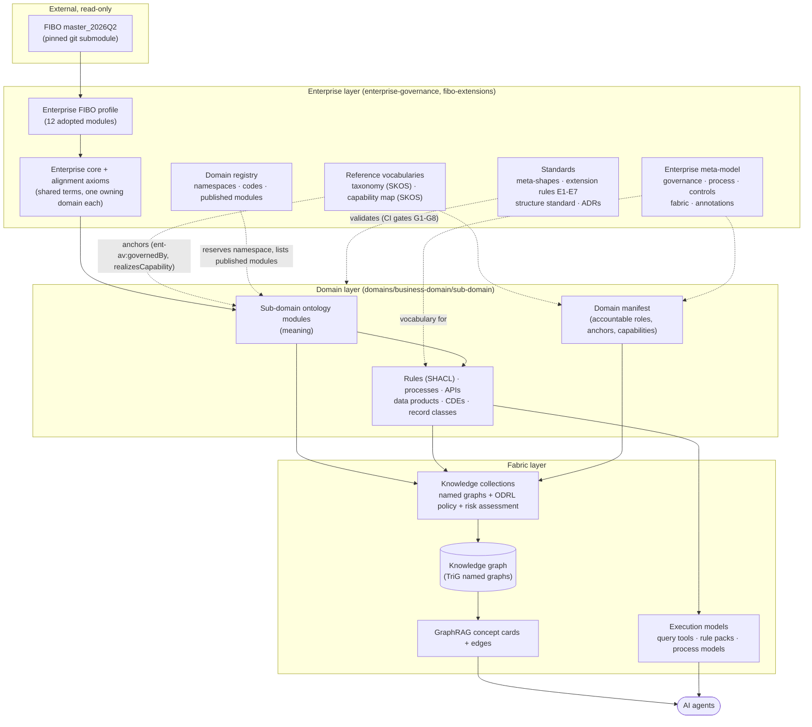
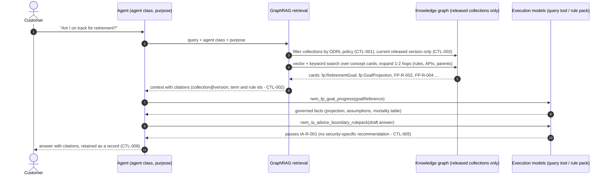

# 1 · Overview

## Purpose

AI agents need more than documents to act correctly in a regulated business. They need to know:
- what a term means, and how it relates to industry-standard meaning (FIBO)
- which business rules apply to it, who owns them, and why
- which processes use it, which steps an agent may take, and where a human must approve
- which APIs and data products serve it, who stewards the data, and how long records are kept
- which of all this they are entitled to use, for what purpose, under which controls

The framework captures all of this as one governed, machine-readable **semantic model**. Its meaning is anchored in an **ontology** built on FIBO, and it is served to agents from a **knowledge graph** through **GraphRAG**.

## The founding principle

> **Business domains are accountable for meaning, rules, data, records and APIs.
> The enterprise governs how that knowledge is represented, shared and consumed by AI.**

Every structural choice in the repository follows from this split (ADR-0002):

| Pillar | Accountable for | Lives in |
|---|---|---|
| **Domain ownership** | Business ontologies · Business rules · Domain APIs · Data stewardship · Record keeping | `domains/<business-domain>/<sub-domain>/` (one folder per sub-domain, generated from the template) |
| **Enterprise governance** | Ontology standards · Semantic review · AI risks & controls · Cross-domain alignment | `enterprise-governance/` and `fibo-extensions/` |
| **Semantic fabric** (part of enterprise governance) | Governed knowledge collections · Knowledge graph management · Reusable semantic assets · Published execution models | Standards and tooling in `enterprise-governance/fabric/`. Each sub-domain's `collections/` and `execution-models/` |

## The layers



Reading the diagram top to bottom:

1. **FIBO** gives industry-standard meaning. It is never edited. It is pinned to a release and consumed through an explicit **enterprise FIBO profile** of adopted modules (ADR-0001).
2. The **enterprise layer** says *how* knowledge is represented. It contains:
   - the standards and the meta-model that every asset is described with
   - the taxonomy and capability map that every asset is anchored to
   - the enterprise core for terms that several domains share
   - the registry that gives each domain its namespace
3. The **domain layer** says *what* things mean and which rules apply. Each sub-domain owns its ontology modules and the rules, processes, APIs, data and records described against them. Its manifest names who is accountable for each.
4. The **fabric layer** is the only route to AI. Each sub-domain publishes a versioned **knowledge collection**, which is assembled into named graphs of the knowledge graph. GraphRAG retrieves **concept cards** from it, and agents call **execution models** for anything that must be computed or checked rather than reasoned in free text.

## How an agent uses it



The agent never re-implements a rule in its prompt. Rules reach it as cards, for explanation, and as rule packs, for enforcement. Both come from the same SHACL shape owned by the rule owner (standard 02).

## What makes it one ontology rather than many

Independent teams can model independently and still produce one coherent enterprise ontology. Five mechanisms make that work:

| Mechanism | Effect | Where it's described |
|---|---|---|
| **One upper ontology** (FIBO, one pinned release, one profile) | Every business class specializes the same foundation | ADR-0001, [doc 3](03-federated-repository-structure.md) |
| **One namespace per sub-domain**, reserved in the registry, following the folder layout | Ownership is visible in every IRI; no two teams mint the same term | ADR-0005, rule E2 |
| **Narrow extension points**: subclass FIBO/core; import only published modules; align through the enterprise | Coupling between domains is explicit, one-directional and reviewable | Rules E1–E7, [doc 3](03-federated-repository-structure.md) |
| **Machine-checked standards** shared by every repository (meta-shapes, structure standard, one tool) | "Consistent" is enforced by CI, not by goodwill | Gates G1–G8, [doc 2](02-enterprise-governance.md) |
| **Coherence checks at increasing scope**: sub-domain → business domain → knowledge graph | Contradictions between teams surface as unsatisfiable classes before release | [doc 3](03-federated-repository-structure.md), [doc 6](06-physical-model.md) |

## Repository at a glance

```
enterprise-governance/            ENTERPRISE: standards, meta-model, meta-shapes, taxonomy, capability map,
                                  alignment register, AI controls, fabric model, GraphRAG contract, semtool, ADRs
fibo-extensions/                  ENTERPRISE: FIBO (pinned submodule), FIBO profile, enterprise core,
                                  alignment axioms, ontology-domain umbrellas, domain registry
domains/
├── domain-template/              ENTERPRISE-owned template every sub-domain is generated from
└── retail-wealth-management/     BUSINESS DOMAIN parent layer: umbrella ontology + parent manifest
    ├── financial-planning/       SUB-DOMAIN (rwm-fp): goals, plans, scenarios, projections   (publishes `planning`)
    └── insights-and-analytics/   SUB-DOMAIN (rwm-ia): insights, health score, advice boundary (builds on financial-planning)
```

Next: [Enterprise governance →](02-enterprise-governance.md)
