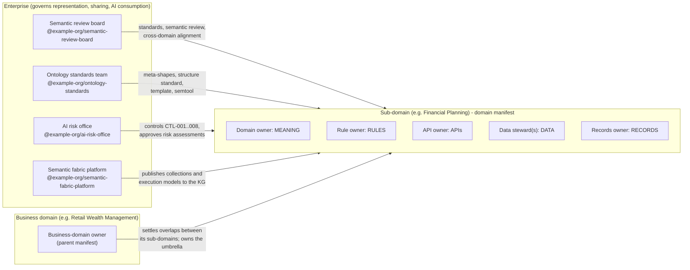
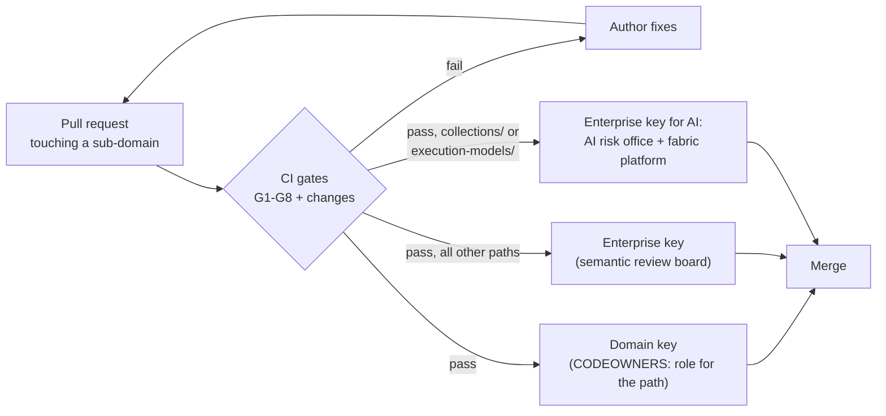
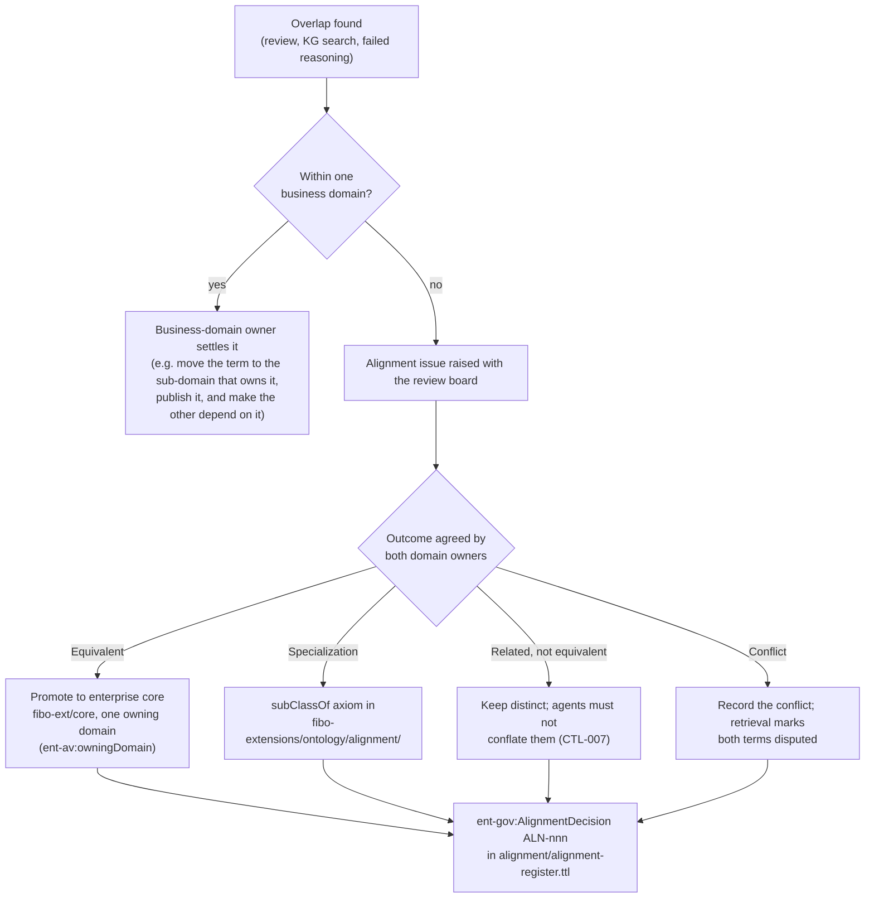

# 2 · Enterprise governance

Enterprise governance decides **how** knowledge is represented, shared and consumed by AI. It never decides **what** a domain's terms mean. This document explains:
- the governing bodies and roles
- how their decisions become files and automated checks ("governance as code")
- the review, release and change processes that keep independent teams consistent

The human-readable operating model is `enterprise-governance/GOVERNANCE.md`. Its machine-readable form is `enterprise-governance/ontology/governance.ttl`. When the two disagree, the ontology wins.

## 2.1 Who governs what

| Body or role | Decides | Does **not** decide |
|---|---|---|
| **Semantic review board** | Standards 01–08; FIBO parent choice; modularity and naming; cross-domain alignment decisions; domain registrations; publication of modules; enterprise-core promotions | Whether a definition is correct for the business; rule thresholds; API product decisions; retention periods |
| **Ontology standards team** | The machine-checked standards and tooling: meta-shapes, structure standard, `domain-template`, `semtool`, CI | Domain content |
| **AI risk office** | Control catalog; sensitivity classes; approval of every collection and execution-model risk assessment | Domain meaning |
| **Semantic fabric platform** | Knowledge-graph loading, named-graph convention, retrieval contract, reusable assets | Domain meaning or rules |
| **Business-domain owner** | Which sub-domains exist; how their overlaps are settled before enterprise alignment is needed; the business-domain umbrella | A sub-domain's internal meaning (its own owner decides) |
| **Sub-domain roles** (domain owner, rule owner, API owner, data steward, records owner) | Meaning, rules, APIs, data and records of their sub-domain | How it is represented (standards) or whether it may reach AI (risk and fabric) |

The full RACI matrix is in `GOVERNANCE.md`. Every role holder and review team is declared in RDF: each sub-domain's `domain-manifest.ttl` and each business domain's `domain.ttl`. That makes accountability queryable in the knowledge graph. Competency question CQ-002 answers "who is accountable for this domain's meaning, rules, APIs, data and records?"

## 2.2 Governance as code

Every governance decision has a file where it is recorded and an automated check that enforces it. Judgement stays with people (semantic review); everything checkable is checked.

| Governance concern | Recorded in | Enforced by |
|---|---|---|
| Ontology standards (annotations, naming, headers, FIBO parentage, taxonomy anchoring) | `ontology/annotations.ttl`, `docs/standards/01` | meta-shapes `shapes/meta-common.ttl`, `meta-business.ttl` (gate G2) |
| Asset standards (manifest, rules, processes, APIs, data, records, collections, execution models) | `ontology/governance.ttl`, `process.ttl`, `fabric/fabric.ttl`, standards 02–04 and 08 | `shapes/meta-assets.ttl` (G2) |
| FIBO use | `fibo-extensions/profile/enterprise-fibo-profile.ttl`, `fibo-extensions/docs/extension-rules.md` | `semtool extensions` E1–E3 (G3), meta-shape E4 (G2), reasoning (G4) |
| Who may mint which IRIs | `fibo-extensions/registry/domain-registry.ttl` | E2 (G3), consistency D2/D7 (G8) |
| Who may reuse whose terms | `ent-gov:publishedModule` in the registry; `dependencies` in `semantic.yaml` | E3 (G3), D4 (G8), cycle check `SubDomainDependencyShape` over all transitive dependencies (G2) |
| Repository shape | `standards/domain-repo-structure.yaml`, `domains/domain-template` | `semtool structure` (G1), `make align` |
| Enterprise taxonomy and capability map | `taxonomy/source/*.md`, `capabilities/source/*.csv`, `capabilities/curation.yaml`, `capabilities/taxonomy-crosswalk.csv` | generated by `semtool taxonomy` / `capabilities`; freshness D9 (G8); anchoring by meta-shapes (G2) |
| Accountability and two-key review | `domain-manifest.ttl` (roles, review teams) | `CODEOWNERS` generated by `semtool codeowners`; freshness D9 (G8); branch protection |
| AI risks and controls | `ontology/controls.ttl`, standard 06 | `KnowledgeCollectionShape`, `ExecutionModelShape`, `RiskAssessmentShape` (G2); runtime enforcement points |
| Cross-domain alignment | `alignment/alignment-register.ttl`, `fibo-extensions/ontology/alignment/` | reasoning over umbrellas (G4); D8 (G8); semantic review |
| Versioning and change classes | `GOVERNANCE.md` change classes, standard 01 §6 | `semtool changes` on pull requests; D1 (G8) |
| Architecture decisions | `docs/adr/NNNN-*.md` | `semtool changes` requires an ADR when shapes or standards change |

## 2.3 Two-key review

Every change to a sub-domain needs two approvals. `CODEOWNERS` is generated from the manifest, so the approvers always match the declared accountability (ADR-0002):

1. **Domain key**: the accountable domain role approves the *meaning*. The rule owner approves `rules/`, the API owner `apis/`, and so on.
2. **Enterprise key**: the semantic review board approves the *representation*: standards conformance, FIBO usage and alignment impact.

On `collections/` and `execution-models/`, the enterprise key is held by the **AI risk office** and the **fabric platform** instead of the review board, because those paths decide what reaches AI. The domain owner remains the domain key.

The enterprise key never changes what a term means. If the representation cannot express the intended meaning, the board raises an ADR against the standard rather than editing the domain's content.

## 2.4 Release gates

Every applicable gate runs for every repository, locally with `make verify` and in CI (`.github/workflows/semantic-ci.yml`). Which gates apply depends on the repository kind:

| Gate | Check | `semtool` command | governance | fibo-extensions | business domain | sub-domain |
|---|---|---|:-:|:-:|:-:|:-:|
| **G1** Syntax & structure | All RDF parses; sub-domains keep the template structure | `syntax`, `structure` | ✔ | ✔ | ✔ | ✔ |
| **G2** Standards | Meta-shapes over every governed asset | `meta` | ✔ | ✔ | ✔ | ✔ |
| **G3** FIBO extension rules | E1 no statements about FIBO; E2 registered namespace; E3 allowed imports | `extensions` | | ✔ | ✔ | ✔ |
| **G4** Logical coherence | Import closure with FIBO classifies with no unsatisfiable classes (ELK; HermiT per business domain in CI) | `closure`, `reason` | | ✔ | ✔ | ✔ |
| **G5** Business rules | Positive examples conform; each negative example trips its rule | `rules` | | | | ✔ |
| **G6** Competency | Competency questions answer over the assembled knowledge graph | `cq` | | | | ✔ |
| **G7** Publishable | Knowledge graph assembles; GraphRAG cards export | `kg`, `cards` | | | | ✔ |
| **G8** Consistency (no drift) | Facts repeated across files agree; generated files are current (see [doc 7](07-change-management.md)) | `drift` | ✔ | ✔ | ✔ | ✔ |
| **PR** Change class | Version bumps match the change class; changed knowledge bumps the collection version; standard changes carry an ADR | `changes --base` | ✔ | ✔ | ✔ | ✔ |

Gates are necessary, not sufficient. Semantic review (standard 05) covers what cannot be automated: correct FIBO parent choice, overlap with other domains, and the safety of agent-facing text.

## 2.5 Change classes and versions

| Class | Examples | Version bump | Review |
|---|---|---|---|
| Editorial | Typo, clearer definition, better example | PATCH | two-key, fast path |
| Additive | New class, property, rule, API mapping, deprecation | MINOR | two-key |
| Breaking | Removed or renamed term, changed parent, domain or range, narrowed rule | MAJOR (MINOR while `0.y.z`) | two-key + ADR + consumer impact note |
| Enterprise standard | New or changed meta-shape, structure standard or control | MINOR/MAJOR in the governance repo | review board + ADR, announced to all domains |

Maturity (FIBO convention) sets how strictly versions are enforced:
- **Provisional**: under design. Version findings from `semtool changes` are warnings, so teams can iterate.
- **Release**: stable and used by an execution model or API. Findings are failures.
- **Informative**: context only.

Collection policies can restrict agents to Release content.

## 2.6 AI risks and controls

The AI risk office owns eight controls (`ontology/controls.ttl`, standard 06). Some are enforced in CI and some at runtime:

| Control | Enforced where |
|---|---|
| CTL-001 answer only from entitled governed collections | CI: every collection must reference it; runtime: retrieval filter |
| CTL-002 cite collection@version plus term and rule ids | agent response contract (cards carry the ids) |
| CTL-003 serve only the current released version | KG publication pipeline; graph names carry the version (D5) |
| CTL-004 no Confidential or Restricted knowledge to external models or training | ODRL prohibitions in each collection policy (G2 warns if a policy states none; their content is checked in semantic review); retrieval runtime |
| CTL-005 regulated-boundary rule pack checks outputs | rule packs (e.g. `rwm_ia_advice_boundary_rulepack`); agent runtime |
| CTL-006 execution models are risk-assessed and trace to rules | CI: `ExecutionModelShape` |
| CTL-007 combine cross-domain terms only through alignment decisions | alignment register; retrieval runtime |
| CTL-008 retain agent-delivered outcomes as records | record classes (e.g. `ia-rec:InsightRecord`); runtime |

Risk assessments live with the asset they cover, in the sub-domain's `collections/` or `execution-models/`, because the domain is accountable for the asset. The approver is always the AI risk office.

## 2.7 Cross-domain alignment

Domains never edit each other's ontologies. When terms overlap, the board runs an alignment:

Examples in the register:
- **ALN-001**: `RetailCustomer` was promoted to enterprise core, owned by Customer Management.
- **ALN-002**: the self-directed insight is *related to but not equivalent to* an advised recommendation. That decision is the advice boundary.

Consistency check D8 fails if the register refers to a term or domain that no longer exists, for example after a rename.

## 2.8 Architecture decision records

Enterprise-level decisions are ADRs in `enterprise-governance/docs/adr/`. Use the template `0000-template.md`, record the change class, and mark superseded ADRs. The current baseline:

| ADR | Decision |
|---|---|
| 0001 | FIBO is the upper ontology, consumed read-only and pinned |
| 0002 | Domains own meaning; the enterprise owns representation (two-key review) |
| 0003 | *Superseded* provisional capability map |
| 0004 | Curated import of the capability map (partly amended by 0005) |
| 0005 | Business domains with sub-domains; IRIs follow the folder layout |
| 0006 | Consistency gate G8 and pull-request change-class check (no drift) |
| 0007 | Known defects in the pinned FIBO/OMG release are patched out of the build closure only |
| 0008 | Semantic Studio: a read-only web view generated from the repositories |
| 0009 | The governance repository is named `enterprise-governance` |

Next: [Federated repository structure →](03-federated-repository-structure.md)
