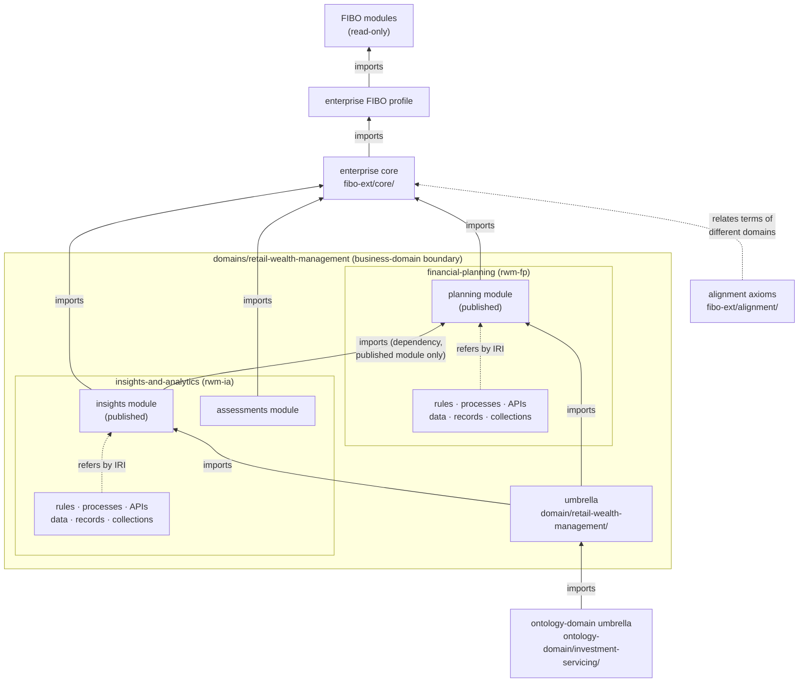
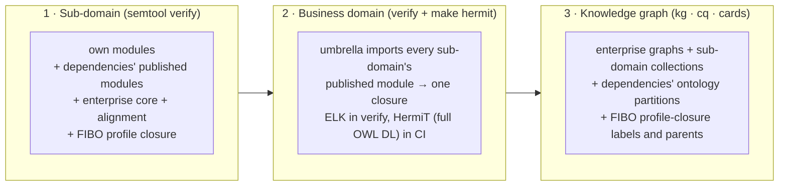

# 3 · Federated repository structure

The repository has to satisfy two forces that pull in opposite directions:

- **Independence.** Each business domain and sub-domain models its own meaning, rules, APIs, data and records. It does this at its own pace, with its own approvers, without waiting for other teams.
- **One enterprise ontology.** Agents must see one coherent body of knowledge: one meaning per term, one FIBO foundation, no contradictions between teams, and one way to find who owns what.

The structure resolves this with **federation behind narrow, checked extension points**. Every team works inside a boundary it owns, and every connection across a boundary goes through a mechanism the enterprise defines and CI enforces.

## 3.1 Repository kinds

Every folder that holds governed knowledge has a `semantic.yaml` that declares its **kind** and how it is wired to the others. `semtool` reads it, and never assumes a layout.

| Kind (`repo_kind`) | Folder | Owned by | Holds | Gates |
|---|---|---|---|---|
| `governance` | `enterprise-governance/` | Semantic review board, ontology standards team, AI risk office, fabric platform | Base IRI and teams (`semantic.yaml`); enterprise meta-model; meta-shapes; structure standard; taxonomy; capability map; alignment register; controls; fabric model; reusable assets; GraphRAG contract; `semtool`; standards; ADRs | G1 G2 G8 |
| `fibo-extensions` | `fibo-extensions/` | Semantic review board (hosts); owning domains (meaning of core terms) | FIBO submodule; enterprise FIBO profile; enterprise core; alignment axioms; ontology-domain umbrellas; domain registry | G1–G4, G8 |
| *(template)* | `domains/domain-template/` | Ontology standards team | The Copier template every sub-domain is generated from (`template/`), and the parent layer for new business domains (`parent-template/`) | its own CI generates a sub-domain from each worked example and runs every gate on it |
| `business-domain` | `domains/<business-domain>/` | Business-domain owner | Umbrella ontology and parent manifest (`domain.ttl`); list of sub-domains | G1–G4, G8 (reasons over all sub-domains together) |
| `domain` (a sub-domain) | `domains/<business-domain>/<sub-domain>/` | The sub-domain's five accountable roles | Meaning, rules, processes, APIs, data, records, collections, execution models, tests, competency questions | G1–G8 |

## 3.2 Layout

```
.
├── Makefile                          verify · drift · changes · hermit · align · taxonomy · capabilities · codeowners
├── .github/workflows/semantic-ci.yml monorepo CI: every gate for every repository
├── enterprise-governance/
│   ├── semantic.yaml                 base_iri, teams, FIBO release tag, named-graph template   ← enterprise settings, once
│   ├── ontology/                     governance.ttl · process.ttl · controls.ttl · annotations.ttl   (meta-model)
│   ├── fabric/                       fabric.ttl · reusable-assets/ · graphrag/retrieval-contract.yaml
│   ├── shapes/                       meta-common.ttl · meta-assets.ttl · meta-business.ttl            (standards as SHACL)
│   ├── standards/                    domain-repo-structure.yaml                                       (structure standard)
│   ├── taxonomy/                     source/enterprise-taxonomy.md  →  enterprise-taxonomy.ttl        (generated)
│   ├── capabilities/                 source/*.csv + curation.yaml + taxonomy-crosswalk.csv
│   │                                   →  capability-map.ttl + data-quality-report.md                 (generated)
│   ├── alignment/                    alignment-register.ttl                                           (ALN-nnn decisions)
│   ├── docs/standards/01…08, docs/adr/
│   └── tools/semtool.py              the one CLI for every repository, locally and in CI
├── fibo-extensions/
│   ├── vendor/fibo/                  FIBO master_2026Q2, git submodule, READ-ONLY
│   ├── profile/                      enterprise-fibo-profile.ttl    (the 12 adopted FIBO modules)
│   ├── ontology/core/                enterprise-core.ttl            (shared terms, each with one owning domain)
│   ├── ontology/alignment/           alignment-axioms.ttl           (implements ALN decisions)
│   ├── ontology/ontology-domains/    <ontology-domain>.ttl          (umbrella per capability-map ontology domain)
│   └── registry/                     domain-registry.ttl            (namespaces, codes, published modules)
└── domains/
    ├── domain-template/              copier.yml · template/ · parent-template/ · answers/ · scripts/
    └── retail-wealth-management/     ── business domain (parent layer)
        ├── semantic.yaml             repo_kind: business-domain; sub_domains: [financial-planning, insights-and-analytics]
        ├── domain.ttl                umbrella ontology + ent-gov:ParentDomainManifest
        ├── financial-planning/       ── sub-domain rwm-fp (publishes `planning`)
        └── insights-and-analytics/   ── sub-domain rwm-ia (depends on financial-planning)
```

Every sub-domain has the same shape. The **structure standard** (`standards/domain-repo-structure.yaml`) is checked by `semtool structure` (gate G1):

```
<sub-domain>/
├── semantic.yaml               wiring: governance / fibo_extensions paths, dependencies, namespace, code, file globs
├── .copier-answers.yml         how it was generated (identity answers are checked against the repo: D2)
├── domain-manifest.ttl         accountable roles + review teams, capabilities, taxonomy anchors, modules, dependencies
├── CODEOWNERS                  GENERATED from the manifest (two-key review)
├── ontology/<module>.ttl       MEANING      domain owner      (one file per module)
├── rules/business-rules.ttl    RULES        rule owner        SHACL shapes {PREFIX}-R-nnn
├── processes/processes.ttl     process knowledge              steps, rules applied, APIs invoked, records created
├── apis/                       APIs         API owner         api-registry.ttl + <name>-api.openapi.yaml (x-ontology-class)
├── stewardship/                DATA         data steward      data products (DCAT/DPROD) + critical data elements
├── records/                    RECORDS      records owner     record classes: retention, legal hold, citation
├── mappings/                   RML mappings from source systems
├── collections/                FABRIC       knowledge collection: 8 named-graph partitions, ODRL policy, risk assessment
├── execution-models/           FABRIC       query tools (.rq + .schema.json), rule packs, process models
├── examples/ · tests/negative/ positive examples; every rule covered by a negative case (nc-NNN expects {PREFIX}-R-NNN)
├── competency-questions/       cq-001…005 from the template; cq-101+ domain-specific
└── docs/modeling-notes.md      the semantic review record
```

## 3.3 Namespaces follow folders

Ownership is visible in every IRI, because IRIs are derived from the folder layout (ADR-0005). The capability map's grouping is not used:

| Folder | IRI | Example |
|---|---|---|
| `domains/<bd>/` | `{base}domain/<bd>/` (umbrella) | `…/domain/retail-wealth-management/` |
| `domains/<bd>/<sd>/ontology/<m>.ttl` | `{base}domain/<bd>/<sd>/<m>/` | `…/domain/retail-wealth-management/financial-planning/planning/` |
| other sub-domain files | `{base}domain/<bd>/<sd>/{governance,rules,processes,apis,stewardship,records}/` | `…/financial-planning/rules/` |
| `fibo-extensions/ontology/ontology-domains/<od>.ttl` | `{base}ontology-domain/<od>/` | `…/ontology-domain/investment-servicing/` |

The ontology domain (*Investment Servicing*) is **metadata** (`ent-gov:inOntologyDomain` in the capability map). Regrouping the map therefore never changes an IRI. Each namespace is **reserved** in `fibo-extensions/registry/domain-registry.ttl` before any term is minted in it (rule E2). The folder, `semantic.yaml`, registry, manifest and template answers must all state the same namespace, and D2 checks this.

## 3.4 Boundaries and extension points

Each team works inside its boundary. Crossing a boundary is only possible through one of these extension points:

| Extension point | Who uses it | How | Enforced by |
|---|---|---|---|
| **Specialize FIBO** | every sub-domain; enterprise core | `rdfs:subClassOf` / `subPropertyOf` a profile class; never a statement *about* a FIBO IRI | E1 (G3), E4 (G2), G4 |
| **Adopt a FIBO module** | enterprise (review board) | add it to `enterprise-fibo-profile.ttl` | E3 (G3) |
| **Use enterprise core** | every sub-domain | import `{base}fibo-ext/core/`; subclass or reference its terms | E3 |
| **Build on a sibling sub-domain** | a sub-domain | all four together: <ol><li>`semantic.yaml` `dependencies`</li><li>`ent-gov:dependsOnSubDomain` in the manifest</li><li>`owl:imports` of the sibling's **published** module</li><li>the module listed as `ent-gov:publishedModule` in the registry</li></ol> One direction only, no cycles. | E3 (G3), `SubDomainDependencyShape` (G2), D4 (G8) |
| **Publish a module** | the owning sub-domain, approved by the board | add `ent-gov:publishedModule` to its registration and to the business-domain umbrella | E3, D3, D6, D7 |
| **Business-domain umbrella** | business-domain owner | `domain.ttl` imports every published module of its sub-domains; `verify` reasons over them together | E3 (only its own sub-domains), D6, G4 |
| **Ontology-domain umbrella** | review board | `fibo-extensions/ontology/ontology-domains/<od>.ttl` imports its business-domain umbrellas; consumers import it, domains never do | E3 (rejects a domain importing it), D6, D7 |
| **Promote to enterprise core** | review board after an alignment decision | move the term to `fibo-ext/core/` with `ent-av:owningDomain` | review; D8 |
| **Relate terms across domains** | review board | axiom in `fibo-extensions/ontology/alignment/` citing ALN-nnn | review; G4; D8 |
| **Reuse a shape** | any sub-domain | `sh:node` a shape in `fabric/reusable-assets/` | review |
| **Reach AI** | every sub-domain | a knowledge collection with policy, sensitivity and approved risk assessment | G2 (`KnowledgeCollectionShape`), D5, CTL-001 |



What is **not** possible, and fails CI:

| Attempt | Fails with |
|---|---|
| Add a label, parent or restriction to a FIBO term | E1 |
| Mint `…/financial-planning/Foo` from insights-and-analytics | E2 |
| Import a FIBO module outside the profile | E3 |
| Import a sibling's module that is not published | E3 |
| Import a sibling without declaring the dependency (or declare one that is not used) | D4 |
| Make financial-planning depend on insights-and-analytics as well (a cycle, of any length) | `SubDomainDependencyShape` |
| Import an ontology-domain umbrella from a sub-domain | E3 |
| Business-domain umbrella imports a module outside its own sub-domains | E3 |
| Two sub-domains assert contradictory axioms about the same terms | G4 (unsatisfiable class, found at business-domain level) |

## 3.5 What a sub-domain decides alone, and what needs the enterprise

| A sub-domain team can, within its own folder | Needs enterprise approval (review board unless noted) |
|---|---|
| Add, change or deprecate its classes and properties | Reserve a namespace (registry) |
| Add or change rules, processes, APIs, data products, CDEs, record classes | Publish a module for other sub-domains |
| Add ontology modules, API specs, competency questions, tests | Adopt a new FIBO module (profile) |
| Declare a dependency on a sibling's **published** module (with the business-domain owner's agreement) | Promote a term to enterprise core, or add an alignment axiom |
| Version and release its knowledge collection | Approve a collection or execution-model risk assessment (AI risk office) |
| Replace role holders in its manifest (then regenerate CODEOWNERS) | Change a standard, meta-shape, control or the template (ADR) |

## 3.6 Coherence at increasing scope

Independent teams are checked together at three levels, so contradictions surface before release:



1. **Sub-domain**: `closure` gathers the sub-domain's own modules, the published modules of its dependencies, enterprise core, the alignment axioms and the FIBO profile, all resolved through XML catalogs. `reason` classifies the result. `rules` validates the rules against the sub-domain's positive and negative examples, in the context of its own and its dependencies' ontology.
2. **Business domain**: the umbrella imports every published module of every sub-domain, so the whole business domain is reasoned as one. This is where the business-domain owner sees conflicts between its sub-domains.
3. **Knowledge graph**: each sub-domain's `kg` loads the enterprise graphs (meta-model, taxonomy, capability map, reusable assets, alignment, FIBO extensions, registry, profile, ontology-domain umbrellas), its own collection partitions, and the ontology partitions of its dependencies. Competency questions and GraphRAG cards run over that assembled graph, with the sub-domain's and its dependencies' examples loaded as test fixtures.

## 3.7 The template keeps sub-domains alike

- **Generation.** `domains/domain-template/scripts/new_domain.py --answers <file> --out domains/<bd>/<sd>` (or `copier copy`) renders a sub-domain that passes every gate immediately. On first use it also scaffolds the business-domain parent layer.
  - The answers are the sub-domain's identity: names, slugs, registry code, prefixes, capabilities, anchors, roles and dependencies. They are recorded in `.copier-answers.yml`.
  - `answers/rwm-fp.yaml` and `answers/rwm-ia.yaml` are the worked examples. `make verify-template` regenerates both in a scratch folder and verifies them.
- **Ownership of files.**
  - *Template-owned*: CI, `.gitignore`, `semantic.yaml` wiring and mapping conventions. `copier update` updates these.
  - *Domain-owned*: every content file, listed in `_skip_if_exists`. These are generated once and then edited **in place**, never renamed or replaced, so every sub-domain keeps the same file names and the same tooling works everywhere.
- **Alignment report.** `make align` regenerates each sub-domain from its own answers and classifies every file as unchanged, edited (expected for domain-owned files), added (where the naming conventions allow), seed-only, or DRIFTED (a template-owned file that differs from the template). It fails when a file is DRIFTED or missing.

## 3.8 Monorepo or separate repositories

Everything is wired through **relative paths** in `semantic.yaml` (`governance: ../../../enterprise-governance`, `fibo_extensions: …`, `dependencies: [../financial-planning]`). The same tooling therefore works in two setups:

- **Monorepo**, as now: one CI workflow at the root (`.github/workflows/semantic-ci.yml`) verifies every repository.
- **Separate repositories**: each has its own workflow. A split-out sub-domain calls the enterprise reusable workflow (`enterprise-governance/.github/workflows/semantic-ci.yml`) with `path: domains/<bd>/<sd>`. The workflow checks the sub-domain out at that path and checks out governance and FIBO extensions beside it, so the relative paths still resolve. Their refs are inputs (`governance-ref`, `fibo-extensions-ref`, default `main`); pin them to release tags for reproducible builds. The generated `ci.yml` already passes the right path.

A change to an enterprise repository must be verified against every registered sub-domain before merge, and the cross-repository consistency checks (D6–D9, [doc 7](07-change-management.md)) need every repository present. In the monorepo, `make verify` does both. With separate repositories, an enterprise integration job has to check them all out in the monorepo layout and run `make verify`. Until that job exists, the monorepo is the supported setup.

Next: [Semantic model and ontology →](04-semantic-model-and-ontology.md)
