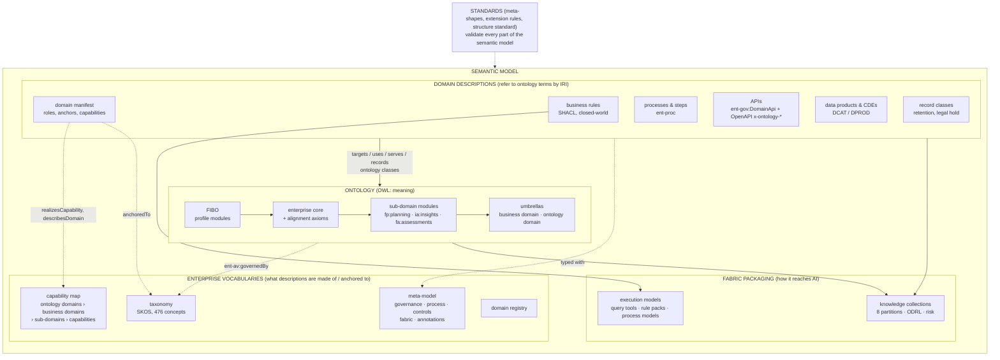
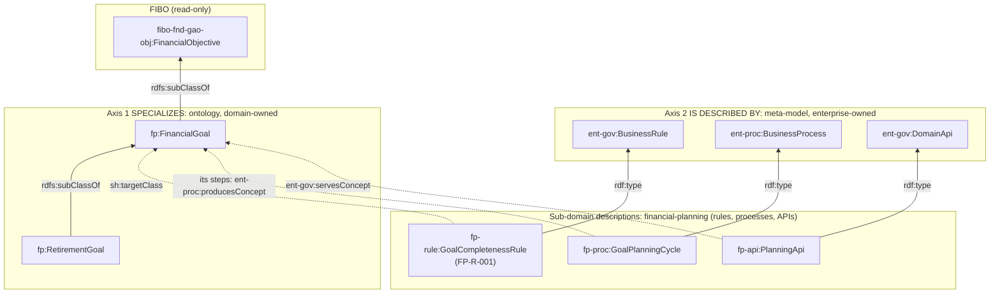
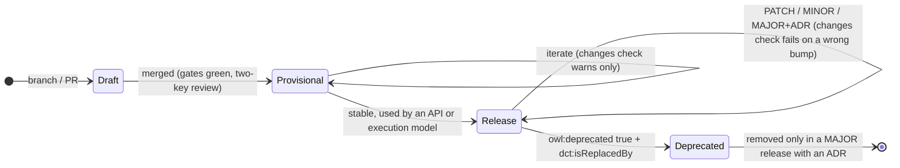
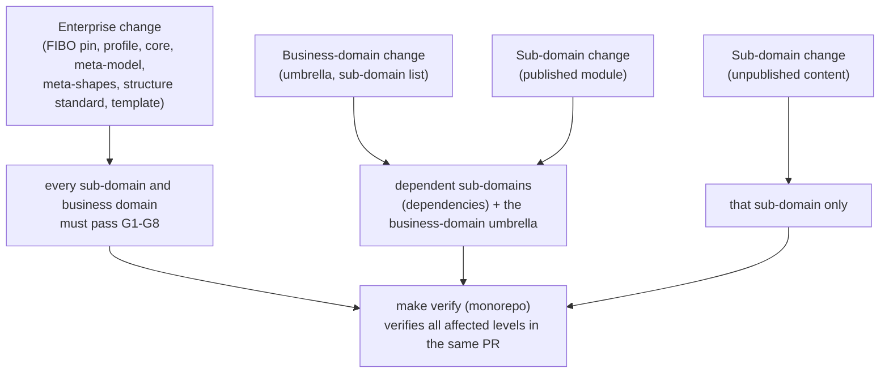

# 4 · The semantic model and the ontology

## 4.1 Two terms, one relationship

The **ontology** is part of the **semantic model**. It is the part that states meaning, and everything else in the semantic model is anchored to it.

| | Ontology | Semantic model |
|---|---|---|
| **What it is** | Classes, properties and logical axioms that define what business things *are* and how they relate | The complete, governed, machine-readable description of the business that an agent is grounded in |
| **Language** | OWL 2 (RDF/Turtle) | OWL + SHACL + SKOS + PROV-O + DCAT/DPROD + ODRL + OpenAPI annotations, all in RDF except the API specs |
| **Semantics** | Open-world. Statements imply other statements; a reasoner infers class membership and finds contradictions | Mixed. The ontology part is open-world; rules are closed-world checks (SHACL); the rest is descriptive metadata about the business |
| **Where** | FIBO (profile) · `fibo-extensions/ontology/core/` · `…/alignment/` · each sub-domain's `ontology/*.ttl` · umbrellas (`domain.ttl`, `ontology-domains/*.ttl`) | All of the ontology, plus the enterprise meta-model, taxonomy, capability map and registry, plus each sub-domain's manifest, rules, processes, APIs, data, records, collections and execution models |
| **Checked by** | G3 extension rules, G4 reasoning (ELK, HermiT), meta-shapes on terms (G2) | G1–G8 |
| **Reaches the agent as** | The `ontology` named graph of each collection; concept cards for classes and properties | All 8 named-graph partitions of each collection, plus enterprise graphs; cards for rules, processes, APIs, data, records and tools; execution models |

The two are kept apart deliberately (rule E7, standard 01 §5):
- **Meaning** goes in the ontology, where a reasoner can check it against FIBO and against other teams' meaning.
- **Business rules** are SHACL shapes. A rule is a closed-world policy owned by a rule owner, not a logical truth about the world. Encoding it as an OWL axiom would let the reasoner draw wrong conclusions, and would give the rule to the wrong owner.
- **Processes, APIs, data products, record classes and accountability** are *descriptions of the business* made with the enterprise meta-model. They refer to ontology terms by IRI but add no axioms to them.
- Each lives in its **own file** with its **own owner** in CODEOWNERS, and stays out of OWL reasoning.

## 4.2 Anatomy of the semantic model

How each part maps to the knowledge graph (standard 08):

| Semantic-model part | Named-graph partition | Source (sub-domain) |
|---|---|---|
| Ontology modules | `…/v{ver}/ontology` | `ontology/*.ttl` |
| Business rules | `…/rules` | `rules/*.ttl` |
| Processes | `…/processes` | `processes/*.ttl` |
| APIs | `…/apis` | `apis/*.ttl` |
| Data products, CDEs | `…/stewardship` | `stewardship/*.ttl` |
| Record classes | `…/records` | `records/*.ttl` |
| Manifest and collections | `…/manifest` | `domain-manifest.ttl`, `collections/*.ttl` |
| Execution models | `…/execution` | `execution-models/*.ttl` |
| Enterprise vocabularies, core, registry, umbrellas | `{base}graph/enterprise/…` | `enterprise-semantic-governance/`, `fibo-extensions/` |
| FIBO labels, definitions and parents used by the domain | `{base}graph/fibo/{release}/profile-closure` | the import closure (`build/closure.ttl`) |

Graph names are `{base}graph/{publisher}/{collection}/v{MAJOR.MINOR.PATCH}/{partition}`, for example `…/graph/rwm-fp/financial-planning/v0.1.0/rules`.

## 4.3 Two axes: *specializes* and *is described by*

Every domain artefact is connected to the enterprise along two independent axes. Keeping them apart is what lets domains own meaning while the enterprise owns representation.

- **Axis 1** is checked by reasoning (G4) and by E1–E4: a domain class must specialize FIBO, directly or through enterprise core, and may never redefine it.
- **Axis 2** is checked by the meta-shapes (G2): a rule must have an identifier, a statement, a policy source, an owner and a taxonomy anchor; an API must declare the concepts it serves; and so on.
- The dotted links **join** the two axes by IRI. They are what let GraphRAG answer "which rules govern this concept, and which API serves it" (the concept card's `governing_rules` and `served_by_apis`).

## 4.4 Who manages which part, and how

### Enterprise level

| Part | Source of truth | Maintained by (approver) | How it's updated | Versioned as | Checks |
|---|---|---|---|---|---|
| FIBO | `fibo-extensions/vendor/fibo` (submodule) + `fibo.release_tag` in governance `semantic.yaml` | Review board | Quarterly upgrade PR ([doc 7 §7.6](07-change-management.md#upgrade-fibo)) | FIBO release tag | D10, G4 for every sub-domain |
| FIBO profile | `fibo-extensions/profile/enterprise-fibo-profile.ttl` | Review board | PR adding or removing `owl:imports` | module semver | E3, G4 |
| Enterprise core | `fibo-extensions/ontology/core/enterprise-core.ttl` | Review board hosts; **owning domain** decides meaning (`ent-av:owningDomain`) | After an alignment decision | module semver | E1, G2, G4, D8 |
| Alignment axioms and register | `fibo-extensions/ontology/alignment/`, `enterprise-semantic-governance/alignment/alignment-register.ttl` | Review board with the consulted domain owners | Alignment process ([doc 2 §2.7](02-enterprise-governance.md#27-cross-domain-alignment)) | module semver | G4, D8 |
| Domain registry | `fibo-extensions/registry/domain-registry.ttl` | Review board | Registration or publication PR | module semver | E2, E3, D2, D7 |
| Ontology-domain umbrellas | `fibo-extensions/ontology/ontology-domains/<od>.ttl` | Review board | When a business domain publishes | module semver | D6, D7 |
| Meta-model | `enterprise-semantic-governance/ontology/*.ttl`, `fabric/fabric.ttl` | Ontology standards team + review board | ADR for new concepts | module semver | G2, D1 |
| Standards (machine-checked) | `shapes/meta-*.ttl`, `standards/domain-repo-structure.yaml` | Ontology standards team + review board | ADR required (`semtool changes`) | module semver / file `version` | every sub-domain's G1–G2 |
| Taxonomy | `taxonomy/source/enterprise-taxonomy.md` → generated `.ttl` | Taxonomy owner via review board | Edit the markdown, run `semtool taxonomy` | generated | D9 |
| Capability map | `capabilities/source/*.csv` + `curation.yaml` + `taxonomy-crosswalk.csv` → generated `.ttl` + report | Capability-map owners; curation by review board (ADR-0004) | Replace or curate the source, run `semtool capabilities` | generated | D9, D2, D6 |
| AI controls | `ontology/controls.ttl` | AI risk office | ADR | module semver | G2 |
| Fabric (reusable assets, retrieval contract) | `fabric/reusable-assets/`, `fabric/graphrag/retrieval-contract.yaml` | Fabric platform + review board | PR | semver | G5 for users of the assets |
| Template and tooling | `domains/domain-template/`, `tools/semtool.py` | Ontology standards team | PR; `copier update` in sub-domains | template release | `make verify-template`, `make align` |

### Business-domain level

| Part | Source of truth | Maintained by | How it's updated | Checks |
|---|---|---|---|---|
| Umbrella ontology | `domains/<bd>/domain.ttl` (`owl:imports`) | Business-domain owner | When a sub-domain publishes a module | E3, G4 (ELK + HermiT), D6 |
| Parent manifest | `domains/<bd>/domain.ttl` (`ent-gov:ParentDomainManifest`) | Business-domain owner | When sub-domains are added or owners change | `ParentDomainManifestShape`, D6 |
| Sub-domain list | `domains/<bd>/semantic.yaml` `sub_domains` + `capabilities/curation.yaml` `sub_domains` | Business-domain owner + review board | Adding a sub-domain ([doc 7](07-change-management.md#add-a-sub-domain)) | D6, D9 |

### Sub-domain level

| Part | File | Accountable role (CODEOWNERS) | Versioned as | Checks |
|---|---|---|---|---|
| Ontology modules (meaning) | `ontology/<module>.ttl` | Domain owner | module semver | G2, G3, G4, D1, D3 |
| Business rules | `rules/business-rules.ttl` | Rule owner | module semver | G2, G5 |
| Processes | `processes/processes.ttl` | Domain owner | module semver | G2 |
| APIs | `apis/api-registry.ttl` + `*-api.openapi.yaml` | API owner | module semver | G2 |
| Data products and CDEs | `stewardship/data-products.ttl` | Data steward | module semver | G2 |
| Record classes | `records/record-classes.ttl` | Records owner | module semver | G2 |
| Manifest | `domain-manifest.ttl` | Domain owner | module semver | G2, D2, D3, D4 |
| Knowledge collection | `collections/collections.ttl` | Domain owner + fabric + AI risk | **collection semver** (drives graph names) | G2, D5, `changes` |
| Execution models | `execution-models/` | Domain owner + fabric + AI risk | module semver | G2, G6 (CQ-005) |
| Tests, examples, competency questions | `tests/`, `examples/`, `competency-questions/` | Domain owner, rule owner | n/a | G5, G6 |

## 4.5 Lifecycle

A module, and each term in it, moves through FIBO's maturity levels. A collection moves through release states in the knowledge graph.

```mermaid
stateDiagram-v2
    direction LR
    [*] --> Built: semtool kg (build/kg.trig)
    Built --> Released: collection vX.Y.Z tagged (graph names carry vX.Y.Z)
    Released --> Serving: fabric loads graphs alongside, switches atomically (CTL-003)
    Serving --> Retired: next version serving; old graphs dropped
    Retired --> [*]
```

The version rules are strict because the knowledge graph serves by version. The same `…/v0.1.0/…` graph name must never carry two different contents, so:
- every content change bumps the module version
- every change to a collection's sources bumps the collection version, and with it every graph name

`semtool changes` enforces both on pull requests. D1 and D5 keep the version IRIs and graph names consistent with the version numbers.

## 4.6 How changes propagate between levels

In the monorepo, one `make verify` runs every level:
1. governance
2. FIBO extensions
3. each sub-domain
4. each business domain, which reasons over its sub-domains together
5. the template

An enterprise change therefore cannot merge while it breaks any domain, and a published-module change cannot merge while it breaks a dependent sub-domain.

Next: [Logical model →](05-logical-model.md)
