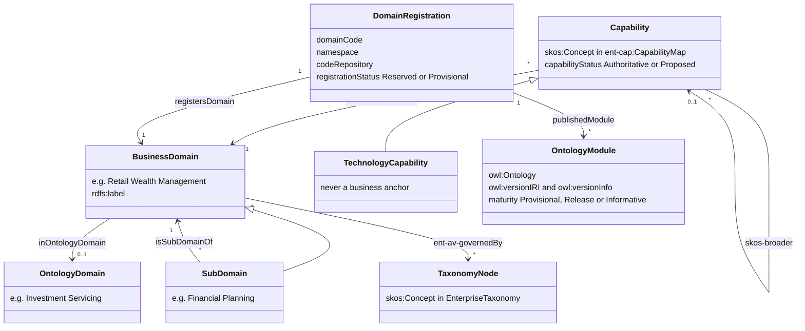
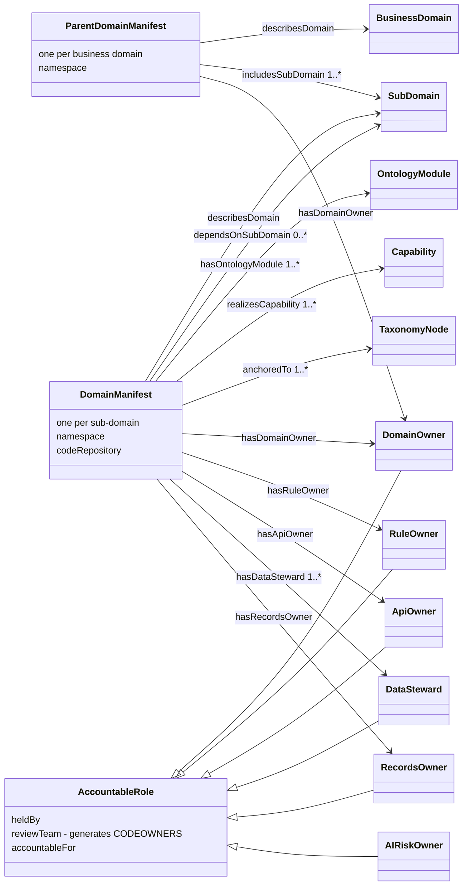
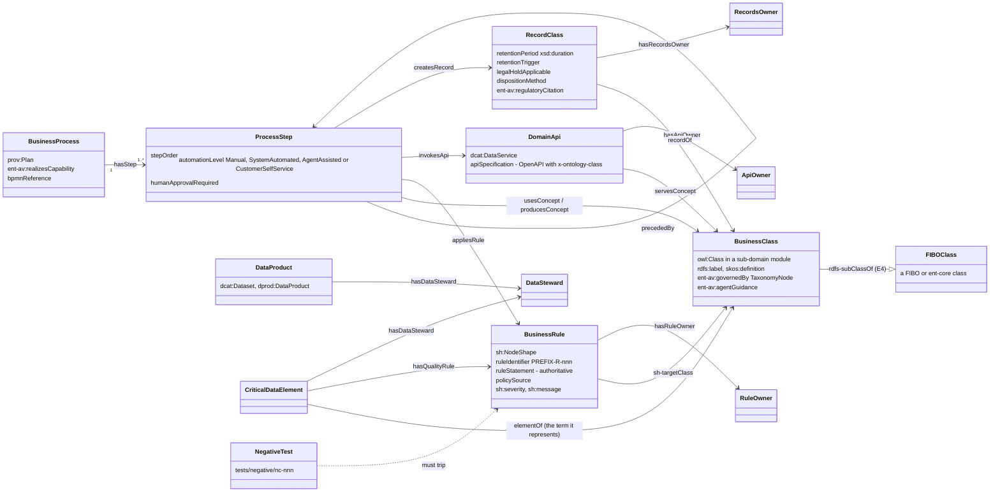
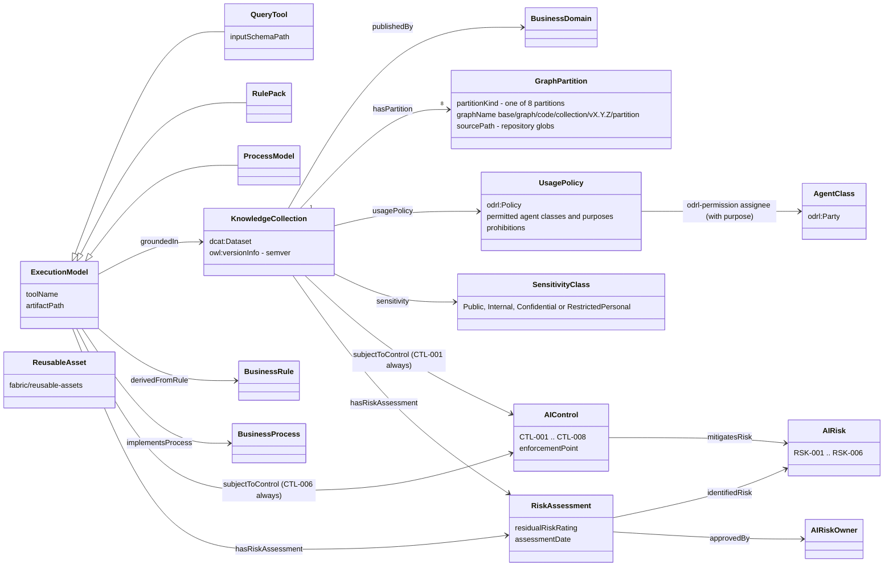
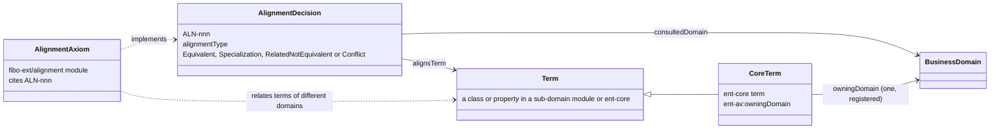
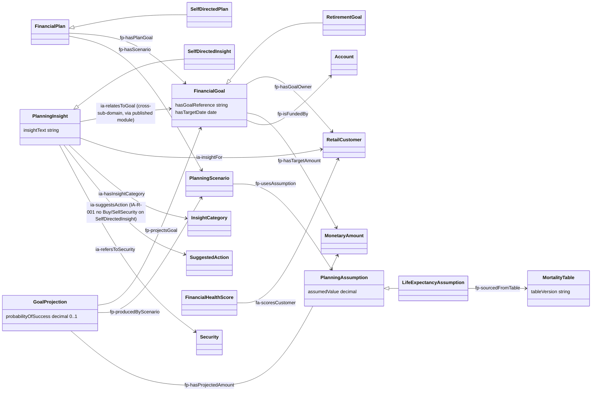
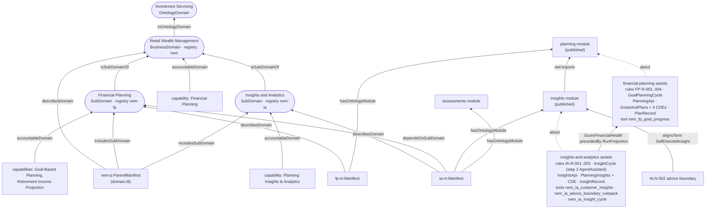

# 5 · Logical model

These diagrams show the **logical** relationships of the semantic model: which kinds of things exist and how they relate. They are drawn from the RDF itself (`ontology/governance.ttl`, `process.ttl`, `controls.ttl`, `fabric/fabric.ttl`, `annotations.ttl`, and the Retail Wealth Management ontologies). Class names drop the prefix for readability:

| Prefix | Namespace | Holds |
|---|---|---|
| `ent-gov:` | `{base}governance/model/` | domains, manifests, roles, rules, APIs, CDEs, record classes, registrations, alignment |
| `ent-proc:` | `{base}governance/process/` | processes and steps |
| `ent-ctl:` | `{base}governance/controls/` | AI risks, controls, risk assessments, sensitivity classes |
| `ent-fab:` | `{base}fabric/model/` | collections, partitions, execution models, agent classes, reusable assets |
| `ent-av:` | `{base}governance/annotations/` | annotation profile (`governedBy`, `agentGuidance`, `ruleStatement`, `owningDomain`, …) |
| `ent-core:` | `{base}fibo-ext/core/` | enterprise core terms |
| `fp:` · `ia:` · `fa:` | `{base}domain/retail-wealth-management/financial-planning/planning/` · `…/insights-and-analytics/insights/` · `…/insights-and-analytics/assessments/` | sub-domain ontology modules |

## 5.1 Capability map, domains and accountability

The enterprise structure that every sub-domain hangs from. The capability map and taxonomy are generated from their sources (ADR-0004). Registrations and manifests are hand-written and checked against them (D2, D6).

**(a) Domain structure, capabilities and the registry**

**(b) Manifests and accountability**

Things to note:
- A **sub-domain is a business domain**: `ent-gov:SubDomain` is a subclass of `ent-gov:BusinessDomain`. Anything that can be said of a business domain (anchors, capabilities, accountability) can be said of a sub-domain.
- **Capability accountability** is one domain per capability (`accountableDomain`). The domain with the deepest anchor is chosen during curation (ADR-0004).
- The **registry** and the **manifest** both point at the same capability-map node, from the enterprise side and the domain side. D2 checks that they agree.
- **Dependencies** are declared at the level of sub-domains (`dependsOnSubDomain`) and implemented at the level of modules (`owl:imports` of a `publishedModule`). D4 keeps the two in step.

## 5.2 Domain assets: what a sub-domain describes

Each sub-domain's rules, processes, APIs, data and records are all **about** its ontology classes. They refer to them by IRI, and each has one accountable owner.

The **rule** has two forms, and both are required (standard 02):
- The **statement** (`ent-av:ruleStatement`) is authoritative.
- The **shape** is how it is checked.

If they disagree, the shape is the defect. An `AgentAssisted` step must apply at least one rule that is published in a rule pack (CTL-005).

## 5.3 Fabric, AI risk and controls: how knowledge reaches AI

## 5.4 Alignment and enterprise core

| Decision | Type | Effect |
|---|---|---|
| ALN-001 | Equivalent | `ent-core:RetailCustomer` (owning domain: Customer Management) replaces per-domain customer classes |
| ALN-002 | Related, not equivalent | `ia:SelfDirectedInsight` must not be conflated with an advised recommendation (the advice boundary; CTL-007) |

D8 checks that every `alignsTerm` still exists, that every consulted domain is in the capability map, and that every core term's owning domain is registered.

## 5.5 FIBO grounding of Retail Wealth Management

Every class specializes FIBO, directly or through enterprise core or another class of the same sub-domain (meta-shape E4; checked by reasoning in G4).

```mermaid
flowchart BT
    subgraph FIBO["FIBO (profile modules)"]
        direction LR
        FO["fibo-fnd-gao-obj:<br/>FinancialObjective"]
        ST["fibo-fnd-gao-obj:<br/>Strategy"]
        EV["fibo-fnd-arr-asmt:<br/>ExpectedValue"]
        AA["fibo-fnd-arr-asmt:<br/>AssessmentActivity"]
        OP["fibo-fnd-arr-asmt:<br/>Opinion"]
        KPI["fibo-fnd-utl-alx:<br/>KeyPerformanceIndicator"]
        CU["fibo-fnd-pas-pas:<br/>Customer"]
        RP["fibo-fnd-arr-rep:<br/>Report"]
        CL["cmns-cls:<br/>Classifier"]
    end
    subgraph CORE["enterprise core (fibo-ext/core)"]
        direction LR
        RC["RetailCustomer<br/>(owner: Customer Mgmt)"]
        MT["MortalityTable<br/>(owner: Common Ref Data)"]
        SDM["ServiceDeliveryModel<br/>(owner: RWM)"]
    end
    subgraph FP["financial-planning · planning module"]
        direction LR
        FG["FinancialGoal"]
        RG["RetirementGoal"]
        PLN["FinancialPlan"]
        SDP["SelfDirectedPlan"]
        PS["PlanningScenario"]
        PA["PlanningAssumption"]
        LEA["LifeExpectancyAssumption"]
        GP["GoalProjection"]
    end
    subgraph IA["insights-and-analytics · insights + assessments modules"]
        direction LR
        PI["PlanningInsight"]
        SDI["SelfDirectedInsight"]
        IC["InsightCategory"]
        SA["SuggestedAction"]
        FHS["fa:FinancialHealthScore"]
    end
    RC --> CU
    MT --> RP
    SDM --> CL
    FG --> FO
    RG --> FG
    PLN --> ST
    SDP --> PLN
    PS --> AA
    PA --> EV
    LEA --> PA
    GP --> EV
    PI --> OP
    SDI --> PI
    IC --> CL
    SA --> CL
    FHS --> KPI
```

The main relationships between these classes (object properties with their domain and range):

`MonetaryAmount` (`fibo-fnd-acc-cur:`), `Account` (`fibo-fbc-pas-caa:`) and `Security` (`fibo-fbc-fi-fi:`) are FIBO classes. `RetailCustomer` and `MortalityTable` are enterprise core.

## 5.6 Worked example: Retail Wealth Management as instance data

The same structures filled in for the current repository. This is what the knowledge graph actually contains, and what competency questions CQ-001 to CQ-003 and CQ-104 query.

Next: [Physical model →](06-physical-model.md)
