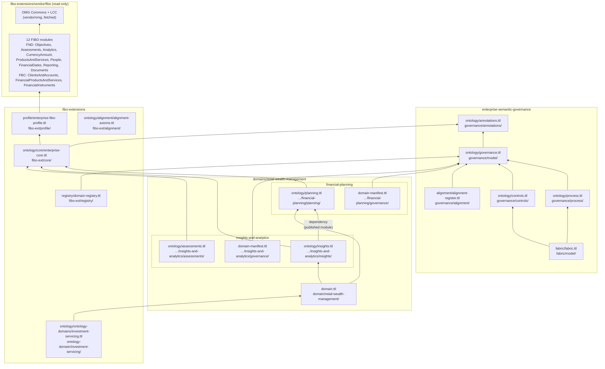
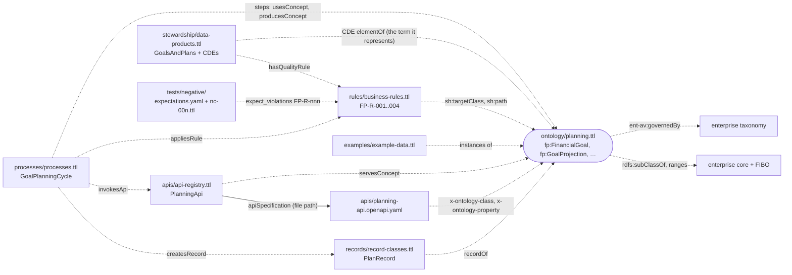
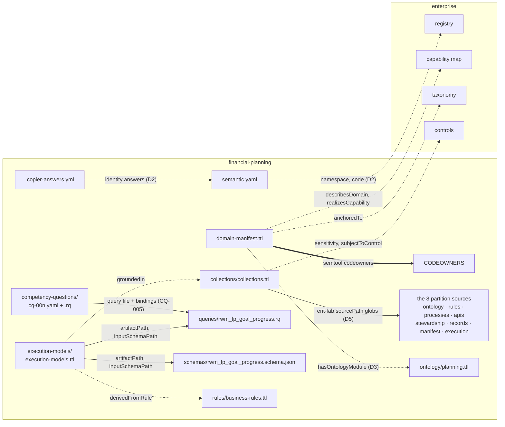
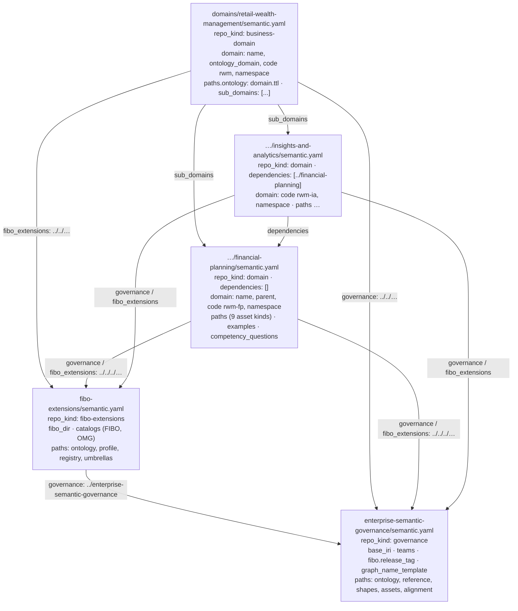
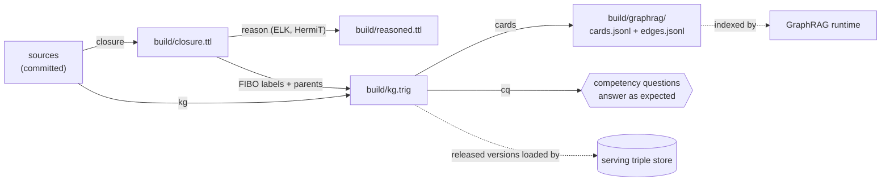
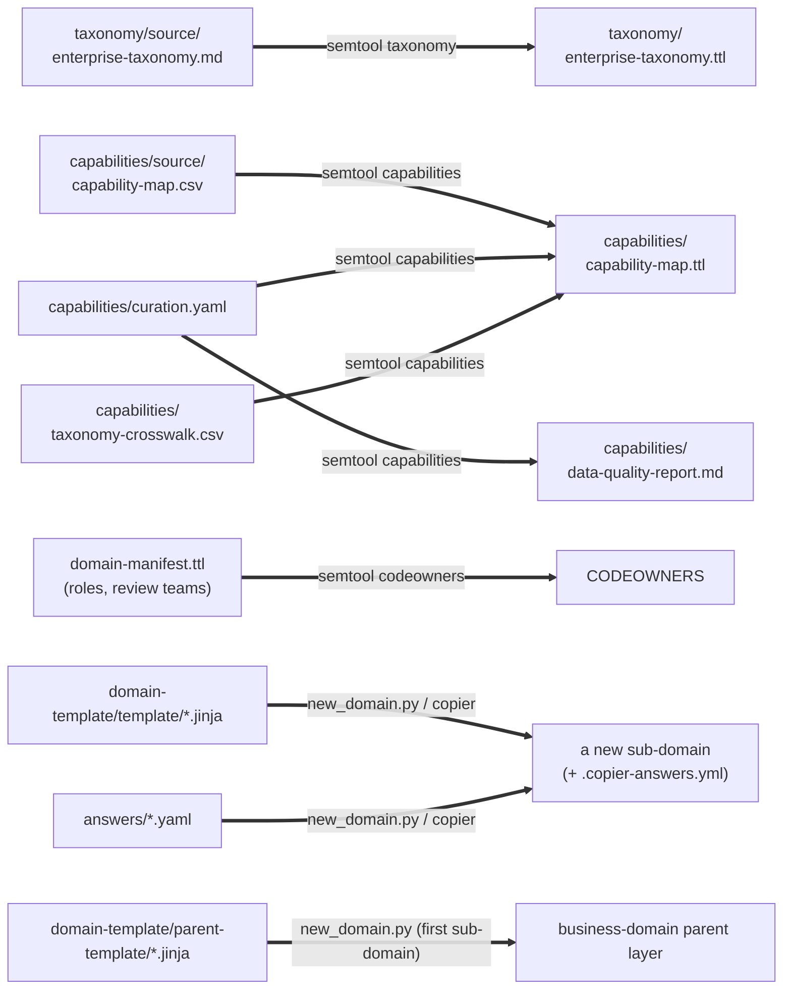

# 6 · Physical model: how the files are linked

The logical model ([doc 5](05-logical-model.md)) is spread across many files in several folders. This document shows how those files are physically connected. There are five kinds of link, and each is resolved and checked differently:

| Link | Expressed as | Example | Resolved by | Checked by |
|---|---|---|---|---|
| **Import** | `owl:imports <module IRI>` in an ontology header | `insights.ttl` imports `…/financial-planning/planning/` | `semtool closure`: an IRI-to-file map built from every `owl:Ontology` header in the governance, FIBO extensions, own and dependency folders, plus FIBO and OMG XML catalogs | E3 (allowed targets), D4 (declared dependency), D6 (umbrella), G4 (coherence) |
| **Reference by IRI** | a term IRI used as the object of a triple, with no import | `sh:targetClass fp:FinancialGoal` in `rules/business-rules.ttl` | loading the files together (meta, rules, kg); by design, **not** by import, so rules, processes, APIs, data and records stay out of OWL reasoning | G2 meta-shapes (`sh:class`), G5, G6, G8 |
| **Configuration pointer** | relative paths and globs in `semantic.yaml` | `governance: ../../../enterprise-semantic-governance`, `dependencies: [../financial-planning]`, `paths.rules: [rules/*.ttl]` | `semtool` (`Repo` class) | D2, D4, D6 |
| **File pointer inside RDF** | a repository-relative path as a literal | `ent-fab:sourcePath "rules/*.ttl"`; `ent-fab:artifactPath`, `ent-fab:inputSchemaPath`; `ent-gov:apiSpecification` | `sourcePath`: `semtool kg` (partitions); `artifactPath` / `inputSchemaPath`: `semtool structure`; `apiSpecification`: documentation only, no command reads it | `sourcePath`: D5 (every partition matches files); `artifactPath` / `inputSchemaPath`: G1 `structure` (file exists and is named after the tool); `apiSpecification`: semantic review |
| **Generation** | a command that writes a file from sources | `curation.yaml` + CSV → `capability-map.ttl`; manifest → `CODEOWNERS` | `semtool taxonomy`, `capabilities`, `codeowners`; `new_domain.py` | D9 (generated files are current) |

## 6.1 The `owl:imports` graph

The actual import graph of the repository. Only ontology modules and umbrellas import. Rules, processes, APIs, stewardship, records, collections and execution models import nothing, and use terms by IRI instead.

Three things to notice:

- `alignment-axioms.ttl` is **not imported** by any module. `closure` adds it, and enterprise core, as a root of every domain's closure, so alignment axioms constrain every domain whether or not the domain knows about them.
- `assessments.ttl` is not imported by the business-domain umbrella, because it is not a *published* module. It is incubated in insights-and-analytics and earmarked for Financial Assessments (`ent-av:owningDomain`), so it is reasoned only within its own sub-domain.
- Domains never import the ontology-domain umbrella. Consumers do. E3 rejects such an import from a sub-domain or business domain.

## 6.2 Inside a sub-domain: references by IRI

How the files of one sub-domain refer to each other, and to the enterprise, without imports. Financial Planning is the example. Every sub-domain generated from the template has the same files and the same links.

**(a) Knowledge files: everything points at the ontology module**

**(b) Governance, fabric and tooling wiring**

Legend: dotted arrows are references by IRI (a triple whose object is a term defined in the other file); solid arrows are file paths; thick arrows are generation.

## 6.3 `semantic.yaml` wiring between repositories

`semtool` never assumes a layout. It follows these pointers. Every pointer is relative, so the same files work in the monorepo and in separate repositories.

What each pointer is used for:

| Pointer | Used by | For |
|---|---|---|
| `governance` | every command | base IRI, teams, FIBO tag, graph-name template; meta-shapes; reference graphs (taxonomy, capability map, meta-model) |
| `fibo_extensions` | `meta`, `extensions`, `closure`, `rules`, `kg`, `cq`, `cards`, `drift` | registry (E2, E3, D2), profile (E3), enterprise core and alignment (closure roots), catalogs, ontology-domain umbrellas (D6) |
| `dependencies` (sub-domain) | `meta` (transitively), `closure`, `rules`, `kg`, `cq`, `cards`, `drift` | the sibling's manifest and ontology as reference (and cycle detection); its published ontology in the closure; its ontology partition and examples in the KG; D4 |
| `sub_domains` (business domain) | `meta`, `closure` (resolving the umbrella's imports), `drift` | the sub-domains' manifests as reference; their modules reasoned together through the umbrella; D6 |
| `paths.*` | every command | which files hold which asset kind; each asset kind maps to one CODEOWNERS owner |

## 6.4 What each gate loads and produces

| Gate | Command | Loads | Writes |
|---|---|---|---|
| G1 | `syntax`, `structure` | every `.ttl` of the repository; the structure standard | — |
| G2 | `meta` | the repository's governed files (the `paths` in `semantic.yaml`, minus examples) as **data**; plus a *reference view* (declarations stripped) of: <ul><li>the governance meta-model, taxonomy, capability map and assets</li><li>the FIBO-extensions ontology and registry</li><li>the dependencies' ontology and manifest</li></ul> Validated against the meta-shapes | — |
| G3 | `extensions` | every governed `.ttl` of the repository; registry; profile | — |
| G4 | `closure`, `reason` | the repository's ontology, dependencies' published modules, enterprise core and alignment, profile, FIBO and OMG through catalogs | `build/closure.ttl`, `build/reasoned.ttl`, `build/closure-unresolved.json` |
| G5 | `rules` | rule shapes + reusable assets (shapes); own ontology, dependencies' ontology, core, and the subclass hierarchy of the closure (context); positive examples; each negative case | — |
| G6 | `cq` | the assembled knowledge graph; `competency-questions/*.yaml` and their queries | — |
| G7 | `kg`, `cards` | enterprise graphs + the collection's partitions + dependencies' ontology partitions + FIBO labels and parents from the closure + examples as test graphs; the retrieval contract | `build/kg.trig`, `build/graphrag/cards.jsonl`, `edges.jsonl` |
| G8 | `drift` | see [doc 7 §7.2](07-change-management.md#72-where-every-fact-lives) | — (the generated-file check works in a temporary copy) |
| PR | `changes --base` | `git diff` against the base; the old version of each changed file (`git show`) | — |

`build/` is never committed (`.gitignore`). CI uploads it as an artifact.

## 6.5 Generated files

Some files are generated from others. They are committed, so they can be reviewed and loaded without running tools. They are **never edited by hand**: D9 regenerates them in a scratch copy and fails if the committed file differs.

| Generated file | Regenerate with | Freshness check |
|---|---|---|
| `enterprise-semantic-governance/taxonomy/enterprise-taxonomy.ttl` | `make taxonomy` | D9 |
| `enterprise-semantic-governance/capabilities/capability-map.ttl`, `data-quality-report.md` | `make capabilities` | D9 |
| `domains/*/*/CODEOWNERS` | `make codeowners` (also run by `verify`) | D9 |
| a sub-domain's template-owned files (CI, `.gitignore`, `semantic.yaml` wiring) | `copier update` | `make align` fails if one differs (DRIFTED) |
| `build/*` | `make verify` | not committed |

## 6.6 How an import IRI finds its file

`semtool closure` never downloads. It resolves each `owl:imports` IRI to a local file:

1. It scans every `.ttl` in the governance repository, FIBO extensions, the repository under test and its dependencies, and maps each `owl:Ontology` IRI to its file.
2. It then reads FIBO's `catalog-v001.xml` and the OMG `catalog-v001.xml` (fetched automatically by `make`, see `make omg`) to map FIBO and OMG IRIs to files under `vendor/`.
3. It follows imports transitively from the roots: own modules, enterprise core and alignment, and the profile. It merges everything into `build/closure.ttl`, and records unresolved IRIs in `build/closure-unresolved.json`. It warns about them rather than failing, because OMG Commons and LCC are absent until `vendor/omg` has been fetched.

This is why the **ontology IRI in a file's header is load-bearing**. If a header IRI changes without every importer changing too, the import stops resolving. The closure only warns, and the reasoner then checks less than intended. D1, D3, D4 and D6 catch the usual versions of that mistake: version IRIs, manifest module lists, dependency imports and umbrella imports. E3 rejects an import of a module that is no longer published.

Next: [Change management without drift →](07-change-management.md)
