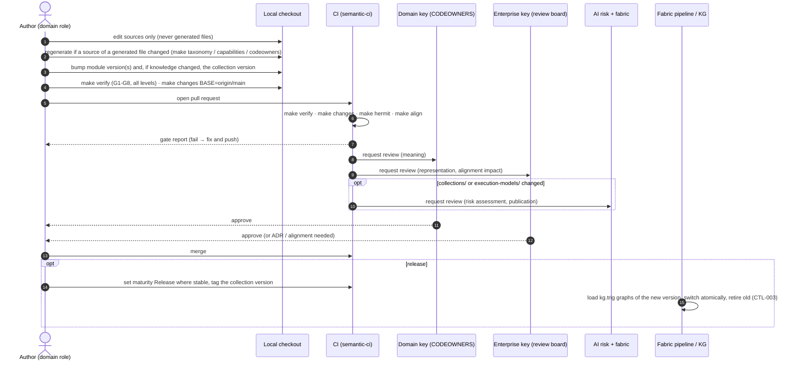

# 7 · Change management without drift

**Drift** is two statements of one fact that no longer agree. It happens in three ways:

- **Between files.** The folder says `financial-planning` but the registry still says `planning-and-guidance`. Or a sub-domain imports a sibling but its manifest does not declare the dependency.
- **Between a file and what generated it.** Someone edits `capability-map.ttl` by hand, or edits `curation.yaml` and forgets to regenerate.
- **Within a version.** `…/planning/0.1.0/` means one thing on Monday and another on Friday, so the knowledge graph serves two meanings under one name.

The framework prevents drift in the **semantic model** and in the **ontology** in three ways:
- it states each fact once wherever possible
- it generates what can be generated
- it checks every necessary repetition in CI

This document lists where each fact lives, what checks it, how versions work, and how to make every common kind of change.

## 7.1 Principles

1. **One source of truth per fact.** Each fact has an authoritative location (§7.2). Anything else that states it is either generated from it, or checked against it by gate G8.
2. **Meaning changes only where it is owned.** A term is changed only in the owning sub-domain's module, or in enterprise core by its owning domain. Nobody edits FIBO (E1), another domain's module (E2), or a generated file (D9).
3. **Cross-boundary links go through extension points.** Imports go only to published modules (E3). Dependencies are declared in three places that must agree (D4). Cross-domain relationships go only through alignment decisions (D8).
4. **Every content change bumps a version.** A module bumps by at least its change class. A collection bumps whenever any of its sources change, because graph names carry the collection version (`semtool changes`).
5. **Never rename an IRI in place once released.** Deprecate it (`owl:deprecated true`, `dct:isReplacedBy`), and remove it only in a MAJOR release with an ADR.
6. **Standards change by ADR.** Meta-shapes, the structure standard, controls and the template change only with an ADR (enforced for shapes and standards by `semtool changes`), and are verified against every domain in the same PR (`make verify`).
7. **Generated files are regenerated, never edited.** Taxonomy, capability map, data-quality report and CODEOWNERS are regenerated and committed together with their source change.
8. **Verify everything that could be affected in the same PR.** In the monorepo, `make verify` covers every level. A change that breaks a dependent sub-domain, the business-domain umbrella or the template cannot merge.

## 7.2 Where every fact lives

| Fact | Authoritative location | Also stated in | Kept in step by |
|---|---|---|---|
| Enterprise base IRI | governance `semantic.yaml` `base_iri` | every IRI in every file | `semtool rebase --all` (the only supported way to change it) |
| FIBO release | governance `semantic.yaml` `fibo.release_tag` | `.gitmodules` branch; submodule checkout; `fibo_release` of the known-upstream-defects register | **D10** |
| Which FIBO modules may be used | `fibo-extensions/profile/enterprise-fibo-profile.ttl` | domain `owl:imports` | **E3** |
| A sub-domain's identity (name, code, namespace) | the folder path (ADR-0005) and the registry entry | `semantic.yaml` `domain.*`; manifest `ent-gov:namespace` and `describesDomain`; `.copier-answers.yml`; capability-map label | **D2**, E2 |
| A sub-domain's place in the business domain | capability map (`isSubDomainOf`, generated from `curation.yaml`) | the folder location; parent `semantic.yaml` `sub_domains`; parent manifest `includesSubDomain` | **D2**, **D6**, **D9** |
| Which modules a sub-domain has | the files in `ontology/` | manifest `hasOntologyModule` | **D3** |
| Which modules are published | registry `ent-gov:publishedModule` | business-domain umbrella `owl:imports`; the module files | **D3**, **D6**, **D7**, E3 |
| Which siblings a sub-domain builds on | `semantic.yaml` `dependencies` | manifest `dependsOnSubDomain`; `owl:imports` of the sibling's published module | **D4**, E3; no cycles of any length (`SubDomainDependencyShape`) |
| A module's version | `owl:versionInfo` | `owl:versionIRI` | **D1**; `changes` (bump size) |
| A collection's version | `ent-fab:KnowledgeCollection` `owl:versionInfo` | every partition's `graphName` | **D5**; `changes` (bump when sources change) |
| What a collection contains | partition `ent-fab:sourcePath` globs | the files | **D5** (every glob matches files) |
| Who is accountable, who reviews | manifest roles (`heldBy`, `reviewTeam`) | `CODEOWNERS` | **D9** (generated) |
| Taxonomy | `taxonomy/source/enterprise-taxonomy.md` | `taxonomy/enterprise-taxonomy.ttl` | **D9** (generated) |
| Capability map | `capabilities/source/*.csv` + `curation.yaml` + `taxonomy-crosswalk.csv` | `capability-map.ttl`, `data-quality-report.md` | **D9** (generated) |
| Cross-domain alignment | `alignment/alignment-register.ttl` | `fibo-extensions/ontology/alignment/`; enterprise core `owningDomain` | **D8** |
| Ontology-domain grouping | capability map `inOntologyDomain` | `fibo-extensions/ontology/ontology-domains/<od>.ttl` umbrella imports | **D6**, **D7** |
| Repository structure | `standards/domain-repo-structure.yaml` + `domains/domain-template` | every sub-domain's files | **G1** `structure`; `make align` (fails on drifted template-owned files) |
| A rule's meaning | `ent-av:ruleStatement` | the SHACL constraints; rule pack; `sh:message` | **G5** (a negative case per rule); semantic review (standard 02) |

## 7.3 The checks

### Gate G8: `semtool drift` (part of `verify`; also `make drift`)

| Code | Checks | Runs in |
|---|---|---|
| **D1** | `owl:versionIRI` = `{ontology IRI}{owl:versionInfo}/` for every module | every repository |
| **D2** | The same identity everywhere:<ul><li>folder ↔ namespace ↔ registry entry (code, not Reserved, repository path)</li><li>manifest namespace and `describesDomain` ↔ capability map (type, label, parent business domain)</li><li>`.copier-answers.yml` (code, namespace path, name, base IRI, capability IRI)</li></ul> | sub-domain, business domain |
| **D3** | Manifest `hasOntologyModule` = the modules in `ontology/`; every module inside the namespace; every published module exists | sub-domain |
| **D4** | `semantic.yaml` `dependencies` = manifest `dependsOnSubDomain` = sub-domains actually imported; dependencies are siblings; no stale dependency | sub-domain |
| **D5** | Every graph name starts with `{base}graph/{code}/{folder}/v{collection version}/`; every partition matches files; the collection is published by this sub-domain | sub-domain |
| **D6** | Business domain:<ul><li>`sub_domains` = the sub-domain folders = `includesSubDomain` = capability-map sub-domains</li><li>umbrella imports = the sub-domains' published modules</li><li>the ontology-domain umbrella imports the business-domain umbrella</li></ul> | business domain |
| **D7** | Every registered, non-reserved domain has its folder with a matching namespace; published modules exist; codes and namespaces are unique; ontology-domain umbrellas import only registered domains | fibo-extensions |
| **D8** | Alignment decisions refer to terms that still exist and to domains in the capability map; enterprise-core owning domains are registered | governance |
| **D9** | Taxonomy, capability map, data-quality report, decision register and every `CODEOWNERS` equal a fresh regeneration; `curation.yaml` `sub_domains` = each business domain's `semantic.yaml` `sub_domains` (which D6 ties to the folders) | governance |
| **D10** | The FIBO branch pinned in `.gitmodules` (root and `fibo-extensions/`), the commit of the release tag (fetched by `make`), and `fibo_release` in `fibo-extensions/profile/upstream-issues.yaml` all equal `fibo.release_tag`; notes if nothing pins a branch or the tag is unavailable | governance |
| **D11** | Every enterprise rule and every targeted meta-shape names a standard (`ent-gov:definedIn`) that exists, down to the section; warns about an accepted decision that no rule cites (`ent-gov:justifiedBy`, ADR-0010) | governance |

Every check is mutation-tested by `make selftest`: each code has at least one seeded defect it must catch ([doc 8 §8.7](08-validation-tooling.md#87-self-test-testing-the-checks-themselves)).

### Pull requests: `semtool changes --base <ref>` (`make changes BASE=origin/main`)

For every governed module that exists at the base and was changed (new modules need no bump; a module whose IRI disappears is reported as breaking):

| Detected change | Change class | Minimum bump |
|---|---|---|
| Term removed; module IRI changed; a `rdfs:subClassOf`, `subPropertyOf`, `domain`, `range` or `sh:targetClass` of an existing term removed or replaced | breaking | MAJOR (MINOR while the version is `0.y.z`) |
| Term added (class, property, shape, concept) | additive | MINOR |
| Other statements or constraints on existing terms changed, including an added parent, constraints inside rule shapes (compared structurally, blank nodes included), and meaning-bearing annotations (`ruleStatement`, `governedBy`, `policySource`, `owningDomain`, `regulatoryCitation`, …) | additive or narrowing | MINOR; the review decides whether it is actually breaking (e.g. a narrowed rule) |
| Only labels, definitions, comments, notes, examples, abstracts, descriptions, `sh:message` / `sh:name` / `sh:description` texts (also inside rule shapes), `agentGuidance`, `businessExample` or `changeNote` changed | editorial | PATCH |
| Only version numbers or graph names changed | release bookkeeping | none |

It also checks two more things:
- If any source of a knowledge collection changed, the **collection version** must change. The graph names then change with it, and D5 checks that they do.
- If `shapes/` or `standards/` changed in the governance repository, the PR must add or change an **ADR** under `docs/adr/`. That includes the rule catalogue, `standards/enterprise-rules.ttl` (rule C3).

Enforcement follows maturity:
- **Release** content: a finding is a failure.
- **Provisional** content: a finding is a warning, so teams can iterate during design.
- `--strict` makes every finding a failure.

### What remains human judgement

The semantic review board (standard 05) still decides what no tool can check:
- whether the FIBO parent is the *right* one
- whether a new term duplicates another domain's term, which calls for an alignment decision
- whether a narrowed rule is breaking
- whether agent-facing text (`agentGuidance`, `sh:message`) is safe

## 7.4 The change workflow

Local commands:

| Command | What it does |
|---|---|
| `make verify` | G1–G8 for governance, FIBO extensions, every sub-domain, every business domain, plus the template check |
| `make drift` | G8 only, for every repository (fast) |
| `make changes BASE=origin/main` | Version and change-class check against the base branch |
| `make hermit` | Full OWL DL reasoning per business domain |
| `make align` | How each sub-domain lines up with the template |
| `make taxonomy` · `make capabilities` · `make codeowners` | Regenerate generated files (commit the result) |
| `make selftest` | Prove every check still catches its seeded defect (after changing the tooling or a standard) |
| `python enterprise-governance/tools/semtool.py <command> --repo <folder>` | Any single check on one repository |

Every command, option, output and error message is explained in [doc 8](08-validation-tooling.md).

## 7.5 Versions

- **Modules** (each `.ttl` with an `owl:Ontology` header): semantic versioning in `owl:versionInfo`, with `owl:versionIRI` = `{module IRI}{version}/` (D1). Bump size follows the change class (§7.3).
- **Collections**: semantic version on the `ent-fab:KnowledgeCollection`. Bump it whenever any partition source changes. Choose the size by the largest change class among the changed modules. Update every `graphName` to the new `v{version}` (D5).
- **`0.y.z`**: while a module has never been released, breaking changes may bump MINOR.
- **Maturity**: move a module to `Release` when an API or execution model depends on it. From then on, version findings fail CI.
- **Generated files** carry no version of their own. Their sources are versioned by git, and D9 keeps them in step.

## 7.6 Playbooks

Each playbook lists the steps, then what catches a missed step.

#### Change a definition, label or agent guidance (editorial)

1. Edit the term in its owning module (`ontology/<module>.ttl`).
2. Bump the module PATCH version (`owl:versionInfo` and `owl:versionIRI`), and the collection version.
3. `make verify`.

*Caught if missed:* D1 (version IRI), `changes` (no bump), G2 (definition missing or label style).

#### Add a class or property

1. Add it to the owning module:
   - classes: the most specific FIBO parent (E5), or a parent in enterprise core or the same module
   - `rdfs:label`, one `skos:definition`, `ent-av:governedBy` (a taxonomy node) and `ent-av:agentGuidance`
   - properties: `rdfs:domain` and `rdfs:range`
2. Search the knowledge graph and other domains for an existing equivalent. If one exists, reuse it or raise an alignment (standard 07).
3. Bump the module MINOR version and the collection version.
4. If it is served, add it to the API registry (`servesConcept`) and the OpenAPI spec (`x-ontology-class`). If it is stewarded, add a CDE. If it is a record, add a record class.
5. `make verify`.

*Caught if missed:* G2 (parent, anchor, definition, naming), E1/E2 (FIBO statement, wrong namespace), G4 (contradiction), `changes` (bump).

#### Add or change a business rule

1. Write the authoritative `ent-av:ruleStatement` first, with the rule owner. Cite `ent-av:policySource`.
2. Add one SHACL shape with the next `{PREFIX}-R-nnn` and a `sh:message`.
3. Add a negative case `tests/negative/nc-nnn-<name>.ttl` and list it in `expectations.yaml`. Keep the positive examples conforming.
4. If an agent must enforce it at runtime, add it to a rule pack (`derivedFromRule`) and reference it from the agent-assisted step (`appliesRule`, CTL-005).
5. Bump the rules module version (MINOR) and the collection version.

*Caught if missed:* G2 (`BusinessRuleShape`), G5 (the negative case must trip this rule), G1 `structure` (every rule has a negative case, `nc-nnn` expects rule `-R-nnn`, and every `nc-*.ttl` is listed), `changes`.

#### Rename, deprecate or remove a term

- **Provisional, never released**: rename freely. Update every reference in the sub-domain, the tests, the queries and the dependents' imports. `make verify` and D8 find leftovers, including an alignment register that points at the old IRI.
- **Released**: do not rename the IRI. Instead:
  1. Add the new term.
  2. Mark the old one `owl:deprecated true` with `dct:isReplacedBy <new>`.
  3. Bump MINOR.
  4. Remove it later, in a MAJOR release, with an ADR and a consumer impact note.

*Caught if missed:* `changes` (removed term needs MAJOR; fails on Release), D8 (alignment points at a missing term), G6 and E3 (dependents break in the same `make verify`).

#### Publish a module for other sub-domains

1. Make sure the module is stable enough to be depended on (consider `Release`).
2. Add `ent-gov:publishedModule <module IRI>` to the sub-domain's registry entry (review board approval).
3. Add the module to the business-domain umbrella `domain.ttl` `owl:imports`.
4. `make verify`. The business domain now reasons over it together with its siblings.

*Caught if missed:* D6 (umbrella does not import a published module), D3/D7 (publishing a module that does not exist), E3 (a dependent imports it before it is published).

#### Build on another sub-domain (add a dependency)

1. Agree it with the business-domain owner. Dependencies run one way.
2. In the dependent sub-domain, do all three:
   - add `- ../<sibling>` to `semantic.yaml` `dependencies`
   - add `ent-gov:dependsOnSubDomain <sibling capability IRI>` to the manifest
   - add `owl:imports <sibling's published module>` to the module that uses it
3. Refer to the sibling's terms only; never mint in its namespace.
4. Add a competency question showing what is used (like `cq-104-builds-on-planning`).

*Caught if missed:* D4 (any of the three missing, or a stale dependency), E3 (module not published), E2 (minting in the sibling's namespace), `SubDomainDependencyShape` (cycle).

#### Add a sub-domain

1. Declare it in `capabilities/curation.yaml` under its business domain (`sub_domains`: name + slug). Propose capabilities if it has none. Run `make capabilities`.
2. Register its namespace `{base}domain/<bd>/<slug>/` in `fibo-extensions/registry/domain-registry.ttl` with status `Provisional`.
3. Write an answers file (copy `domains/domain-template/answers/rwm-fp.yaml`), then run `python domains/domain-template/scripts/new_domain.py --answers <file> --out domains/<bd>/<slug>`. This also adds the sub-domain to the parent `semantic.yaml`.
4. Add `ent-gov:includesSubDomain` to the parent manifest in `domains/<bd>/domain.ttl`. The script prints the exact line.
5. Fill in the manifest roles, then `make codeowners` and `make verify`.

*Caught if missed:* D2 (registry, capability map or answers disagree), D6 (parent lists, capability map), D9 (capability map not regenerated, or `curation.yaml` not updated), E2 (namespace not registered).

#### Add a business domain

1. The business domain must exist in the capability map (source CSV). Declare its sub-domains in `curation.yaml`, then `make capabilities`.
2. Register the business-domain namespace `{base}domain/<bd>/` and each sub-domain namespace.
3. Generate the first sub-domain. `new_domain.py` scaffolds the parent layer from `parent-template/`.
4. Add the business-domain umbrella to its ontology-domain umbrella in `fibo-extensions/ontology/ontology-domains/<od>.ttl`. Create that umbrella if the ontology domain has none.

*Caught if missed:* D6 (no ontology-domain umbrella, or it doesn't import this domain), D7 (umbrella imports an unregistered domain), D2.

#### Resolve an overlap between domains

1. **Within one business domain**, the business-domain owner decides. Move the term to the sub-domain that owns it, publish it, and make the other a dependent.
2. **Across business domains**, raise an alignment with the review board, then:
   - record `ent-gov:AlignmentDecision` ALN-nnn in `alignment/alignment-register.ttl` (terms, consulted domains, type)
   - implement it: promote the term to enterprise core with `ent-av:owningDomain`, add an axiom in `fibo-extensions/ontology/alignment/` citing ALN-nnn, or record that the terms are related but not equivalent
   - the domains replace their local term by subclassing or deprecating it

*Caught if missed:* G4 (contradictory axioms become unsatisfiable at the business-domain level), D8 (register points at a missing term, or core names an unregistered owner).

#### Adopt a FIBO module

1. Add `owl:imports <FIBO module>` to `fibo-extensions/profile/enterprise-fibo-profile.ttl`, with a comment on why.
2. Bump the profile version. `make verify` checks every domain against the larger closure.

*Caught if missed:* E3 (a domain importing a module outside the profile).

#### Upgrade FIBO

1. Follow `fibo-extensions/docs/upgrading-fibo.md`:
   - move the submodule to the new `master_YYYYQn` tag
   - update the `.gitmodules` branch **and** `fibo.release_tag` in governance `semantic.yaml` (`make` then fetches the new OMG dependencies itself)
2. Re-validate every entry of `fibo-extensions/profile/upstream-issues.yaml` (known FIBO/OMG defects, ADR-0007):
   - remove entries fixed upstream (`closure` reports them as no longer applying)
   - record any new defect that makes the closure incoherent
   - set `fibo_release` to the new tag
3. `make verify` and `make hermit`. Fix domain classes whose FIBO parent was deprecated or moved (owning domains, before merge).
4. List the relevant FIBO release notes in the PR.

*Caught if missed:* D10 (pin mismatch, or the defects register not re-validated), G4 (parents gone or incoherent; new upstream defects), E1 (FIBO IRIs now used differently).

#### Change a standard (meta-shape, structure standard, control, meta-model)

1. Write an ADR (`docs/adr/NNNN-…md`, see `docs/adr/README.md`): the reasoning and the rejected alternatives, not the rule itself.
2. Change the shape, standard or vocabulary. Bump its version.
3. Link it in `standards/enterprise-rules.ttl`:
   - `ent-gov:definedIn`: the standard that defines it
   - `ent-gov:justifiedBy`: the ADR

   For a new rule, add it to the catalogue with its code. If the ADR supersedes another, re-link that decision's rules.
4. `make decisions`, then `make verify`. Every domain must pass the new standard in the same PR. Otherwise fix those domains in the PR, or introduce the shape at `sh:Warning` first and raise it to `sh:Violation` in a later release.
5. Announce it to all domains. Update the template if new domains need new content.

*Caught if missed:*
- `changes`: a shape or standard change without an ADR (C3)
- G2: a link to a missing or superseded decision
- D9: the register not regenerated
- D11: a missing standard or section
- every domain's G1/G2

#### Update the taxonomy or the capability map

1. Edit `taxonomy/source/enterprise-taxonomy.md`, or replace `capabilities/source/capability-map.csv` and review `curation.yaml` and `taxonomy-crosswalk.csv`.
2. `make taxonomy` / `make capabilities`. Read `data-quality-report.md` for exclusions and gaps.
3. `make verify`. Anchors and capabilities used by domains must still exist.
4. Commit sources and generated files together.

*Caught if missed:* D9 (generated files stale), G2 (a domain anchored to a node that no longer exists), D2/D6 (a sub-domain disappeared from the map).

#### Change role holders or review teams

1. Edit the roles in the sub-domain's `domain-manifest.ttl` (or the parent `domain.ttl`).
2. `make codeowners`, then commit the manifest and `CODEOWNERS` together.

*Caught if missed:* D9 (CODEOWNERS out of date), G2 (a role without a holder or review team).

#### Improve the template

1. Change `domains/domain-template/template/` (and `copier.yml` if needed). `make verify-template` generates both worked examples and runs every gate on them.
2. Template-owned files (CI, `.gitignore`, `semantic.yaml` wiring) reach existing sub-domains with `copier update`, or by re-rendering from each sub-domain's `.copier-answers.yml`. Changes to domain-owned files go in the template's release notes, and each domain applies them by hand.
3. If the structure standard changes too, bump `standards/domain-repo-structure.yaml` `version` and write an ADR.

*Caught if missed:* `make align` fails when a sub-domain's template-owned file (anything not in `_skip_if_exists`) differs from the template (DRIFTED), G1 `structure`.

#### Release a knowledge collection

1. Bump the collection `owl:versionInfo` (the largest change class since the last release) and every `graphName` (`…/v{new}/…`).
2. Move stable modules to `Release` maturity.
3. Check that the risk assessment is still approved for the new content (AI risk office). Update it if the scope changed.
4. Merge. The fabric pipeline loads the new graphs alongside the old ones, switches atomically and retires the old version (CTL-003).

*Caught if missed:* D5 (graph names don't match the version), `changes` (sources changed without a collection bump), G2 (`KnowledgeCollectionShape`: policy, sensitivity, controls, approved risk assessment).

#### Adopt the real enterprise namespace

1. `python enterprise-governance/tools/semtool.py rebase --to https://ontology.<company>.com/ --all`. This rewrites every repository, sub-domain, business domain and the template.
2. `make verify`.

*Caught if missed:* D2/D7 (a namespace or registry entry left on the old base), E2.

## 7.7 Anti-patterns

| Don't | Why | Caught by |
|---|---|---|
| Edit `capability-map.ttl`, `enterprise-taxonomy.ttl`, `data-quality-report.md` or `CODEOWNERS` | Overwritten on the next regeneration; meanwhile the source says something else | D9 |
| Add a label or superclass to a FIBO term "just locally" | Two meanings for one FIBO IRI; upgrades conflict | E1 |
| Copy another sub-domain's class into your module | Duplicate meaning with no alignment | E2 (if minted in their namespace); semantic review and alignment otherwise |
| Import a sibling's module directly without declaring the dependency | Hidden coupling; breaks when they refactor | D4, E3 |
| Rename a folder, prefix or code in one place | Registry, manifest, answers, graph names and imports fall out of step | D2, D3, D5, D6, D7 |
| Change a module's content but not its version | Two contents under one version IRI; the KG serves both | `changes`, D1 |
| Change knowledge without bumping the collection | The same graph name carries different content | `changes`, D5 |
| Encode a business threshold as an OWL restriction | Wrong owner; open-world inference makes wrong conclusions | review (E7) |
| Put rules, processes or APIs inside the ontology module | They enter OWL reasoning and lose their own owner | semantic review (standard 01 §5) |
| Tighten a meta-shape without an ADR and without checking all domains | Breaks every domain at once | `changes` (ADR), `make verify` |

## 7.8 Pull-request checklist

- [ ] `make verify` green locally (G1–G8, every level); `make changes BASE=origin/main` shows no failures
- [ ] Only sources edited; generated files regenerated and committed with them
- [ ] Module versions bumped by the change class; collection version and graph names bumped if knowledge changed
- [ ] New or changed rules have a statement, policy source, owner and a negative test
- [ ] New classes have the closest FIBO parent (`FIBO-GAP` noted if none fits) and a taxonomy anchor
- [ ] No overlap with another domain's term, or an alignment decision recorded
- [ ] Cross-sub-domain use goes through a declared dependency on a published module
- [ ] Breaking change to Release content: ADR and consumer impact note
- [ ] Standard, template or control change: ADR, and every domain still passes
- [ ] Collections and execution models: risk assessment still approved

Next: [Validation tooling reference →](08-validation-tooling.md)
