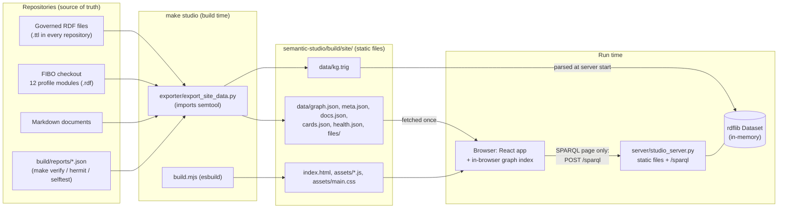
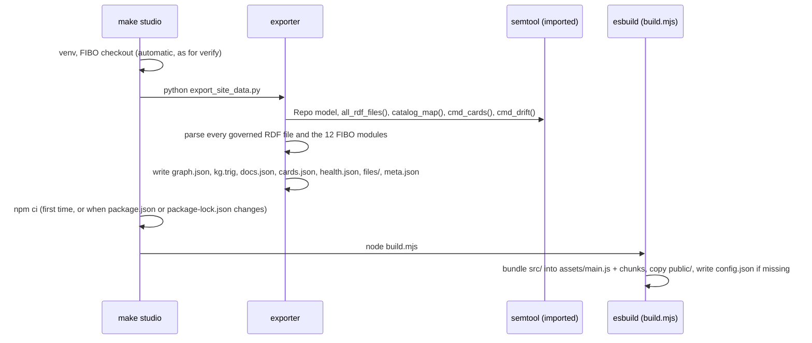
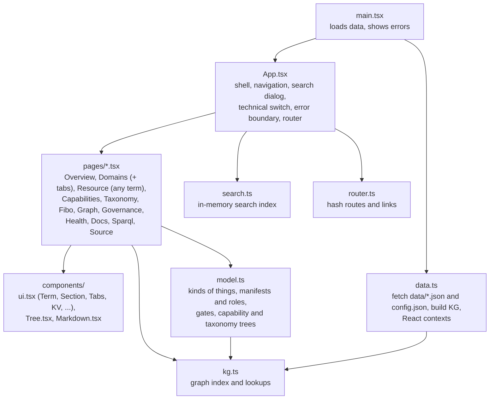
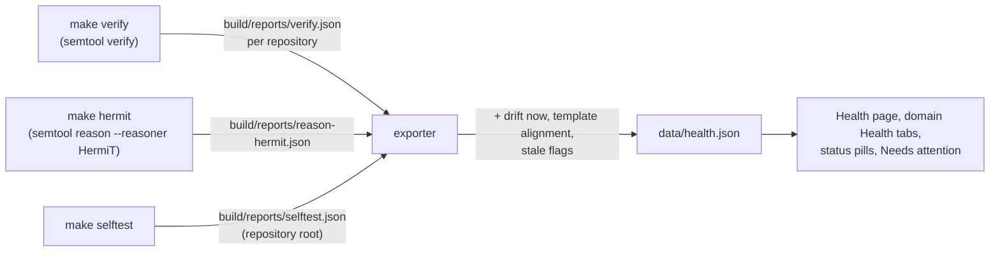
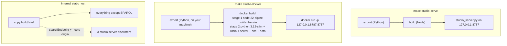

# Semantic Studio: architecture and implementation

This document explains how Semantic Studio is built: what happens at build time, what runs when you use it, where the SPARQL store and engine come from, and how to extend it. For running it, see the [README](../README.md); for why it is built this way, see [§10 Design choices](#10-design-choices).

## 1. The short version

Semantic Studio has three parts.
- **Exporter (build time, Python).** It reads the repositories and writes static files.
- **Site (in the browser, TypeScript).** It loads those files and shows them.
- **Server (run time, Python).** It serves the site and answers SPARQL.



Two engines work over the same triples:

| | Browser graph index | SPARQL store and engine |
|---|---|---|
| Used by | every page: domains, terms, trees, graphs, health, search | the SPARQL page only (and its examples and competency questions) |
| Built from | `data/graph.json` | `data/kg.trig` |
| Built when | when the page loads (about 0.1 s) | when the server starts (about 0.7 s) |
| Code | `src/kg.ts` (TypeScript) | rdflib (Python) in `server/studio_server.py` |
| Answers | fixed lookups that the pages need: a term's facts, who refers to it, ancestors, lists | any SPARQL 1.1 query |
| Needs a server | no: works from any static host | yes |

The pages never send SPARQL. They use the browser index, so browsing works on a static host. Only the SPARQL page needs the server.

## 2. SPARQL: the store and the engine

### What the build creates

The build does **not** create a database or a triple store. It writes a single file, `data/kg.trig`, in **TriG**: a text format for RDF that keeps named graphs.
- Each governed source file becomes one named graph called `urn:x-semantic-studio:file/<path in the repository>`. Examples are `urn:x-semantic-studio:file/domains/retail-wealth-management/financial-planning/rules/business-rules.ttl` and `urn:x-semantic-studio:file/fibo-extensions/vendor/fibo/FND/GoalsAndObjectives/Objectives.rdf`.
- It contains about 17,500 triples in 60 graphs, in a 1.5 MB file. The source files are:
  - every governed RDF file of every repository (`semtool`'s `Repo.all_rdf_files()`), including examples and negative test cases
  - the 12 FIBO modules of the enterprise profile, from the pinned checkout
  - labels, definitions and parents of the other FIBO/OMG terms domains use, taken from `build/closure.ttl` where `make verify` has built one
- Blank-node ids are renamed per file (`f<file>b<n>`), so two files' blank nodes never merge.

The exporter builds this file with rdflib: it adds each parsed file to an rdflib `Dataset` and serializes it as TriG (`GraphExport.add_graph` and `main` in `exporter/export_site_data.py`).

### What the server creates

When `studio_server.py` starts, it parses `kg.trig` into an **rdflib `Dataset` backed by rdflib's `Memory` store**: `Dataset(default_union=True)`.
- **Store.** It is an in-process, in-memory store: Python dictionaries that index every triple three ways (subject→predicate→object, predicate→object→subject, object→subject→predicate), plus an index of which named graph each triple is in.
  - There is no disk file or database, and nothing is written while the server runs.
  - The graph lives as long as the process. A new export is picked up by restarting the server (`make studio-serve` does this every time it runs).
- **Default graph.** `default_union=True` makes the default graph the union of all named graphs. So `SELECT * WHERE { ?s ?p ?o }` sees everything, and `GRAPH ?g { ... }` tells you which source file said it.
- **Engine.** Queries run on **rdflib's own SPARQL 1.1 implementation** (`rdflib.plugins.sparql`), in pure Python:
  1. **Parse.** A grammar (pyparsing) parses the query text, which must be a query, not an update.
  2. **Translate.** The parse tree becomes SPARQL algebra (BGPs, joins, OPTIONAL, FILTER, GROUP BY and so on).
  3. **Evaluate.** Each triple pattern is a lookup in the store's indexes. Patterns are joined pattern by pattern with nested loops, and filters, aggregates and ordering run in Python.
  - The only optimisation is a simple heuristic that evaluates the patterns with more fixed terms first. There is no planner using statistics, and no caching between queries.
  - It supports SELECT, ASK, CONSTRUCT and DESCRIBE; property paths (`rdfs:subClassOf+`); aggregates; subqueries; and `GRAPH`.

### Protocol and limits

| | |
|---|---|
| Endpoint | `/sparql`: `GET ?query=…`, or `POST` as `application/x-www-form-urlencoded` (`query=…`) or `application/sparql-query` |
| Results | SELECT and ASK as `application/sparql-results+json`; CONSTRUCT and DESCRIBE as Turtle |
| Refused | SPARQL Update (it doesn't parse as a query); `SERVICE` (would call other URLs); `FROM` / `FROM NAMED` (would make rdflib load other files or URLs). `rdflib.plugins.sparql.SPARQL_LOAD_GRAPHS` is also set to `False`. |
| Time limit | `--timeout` (30 s). Queries run on a pool of 4 worker threads; a query past the limit is answered with 503 but keeps its thread until it finishes, because Python threads can't be stopped. |
| Size limit | `--max-rows` (5,000) for SELECT; CONSTRUCT/DESCRIBE results over ten times that are refused |
| Cross-origin | off unless `--cors-origin <origin>` names the one origin allowed to call it |

The site's SPARQL page also adds `PREFIX` lines for any known prefix a query uses without declaring it. The known prefixes are every prefix declared in a governed file or a FIBO module, from `meta.json`.

### How fast it is, and how far it scales

These figures were measured on the current export (about 17,500 triples):

| | |
|---|---|
| Load `kg.trig` at start | 0.7 s, about 60 MB of process memory |
| All classes with labels (1,050 rows) | about 180 ms |
| `COUNT(*)` over everything | about 170 ms |
| `rdfs:subClassOf+` closure (3,700 rows) | about 270 ms |
| Triples per source file (`GRAPH ?g`, GROUP BY) | about 360 ms |

rdflib's memory store and engine are comfortable up to a few hundred thousand triples. Beyond that, loading takes tens of seconds, memory grows to gigabytes, and joins slow down noticeably. FIBO in full, with all its modules (not just the 12 in the profile), or many more domains, would be the point to change engines. The site would not need to change, because it only knows the endpoint URL (`sparqlEndpoint` in `config.json`):
- **pyoxigraph** (Oxigraph, a Rust store and engine with a planner) behind the same `studio_server.py` protocol. It is much faster, and can be on disk.
- **Oxigraph compiled to WebAssembly, in the browser.** This needs no server at all, so a static host is self-contained.
- **Apache Jena Fuseki or GraphDB** loading the same `kg.trig`. Both are standard SPARQL 1.1 endpoints.

## 3. Build time: `make studio`



### The exporter (`exporter/export_site_data.py`)

It imports `semtool` (`enterprise-governance/tools/semtool.py`), so it finds repositories, files and FIBO modules exactly as the checks do. Nothing it does changes a governed file.

| Step | Function | Notes |
|---|---|---|
| Find repositories | `discover_repos` | governance, fibo-extensions, `domains/*` (business domains), `domains/*/*` (sub-domains): every folder with a `semantic.yaml` |
| Classify files | `file_roles` | each file's role from `semantic.yaml` `paths` (ontology, rules, apis, ...) and `examples` (positive, negative) |
| Load the graph | `export_graph`, `GraphExport` | every governed RDF file, then the 12 profile modules (located through FIBO's XML catalog, as `semtool closure` does), then labels and parents from domain closures |
| Documents | `export_docs` | every tracked `.md` (`git ls-files`), with a title, a group (framework, standards, adr, domains, repository) and the ADR status |
| Agent cards | `export_cards` | runs `semtool cards` for each sub-domain, reads `build/graphrag/*.jsonl` |
| Health | `export_health` | reads every `build/reports/*.json`; runs drift (G8) for every repository and `compare_domain.py` for every sub-domain; marks reports stale; reads the upstream defect register |
| Source files | `copy_sources` | copies tracked text files (`.ttl .yaml .rq .json .md .csv ...`) to `data/files/`, for the source viewer; FIBO is linked on GitHub instead |
| Metadata | `main` | commit, branch, whether the tree is modified, remote URL without credentials, base IRI, FIBO release and pin, prefixes, repositories with their files, negative tests and competency questions |

It takes about 8 s, mostly drift and alignment. `--skip-live` skips those two; `--out` writes somewhere else.

### What it writes (`build/site/data/`)

| File | Size now | Contents |
|---|---|---|
| `meta.json` | 60 KB | build metadata; repositories (kind, code, prefix, namespace, parent, sub-domains, dependencies, files and roles, negative tests, competency questions with their queries); the FIBO modules; the prefixes; warnings |
| `graph.json` | 1.1 MB | the triples, in the compact form below |
| `kg.trig` | 1.5 MB | the same triples, one named graph per file, for the SPARQL server |
| `docs.json` | 290 KB | every markdown document: path, group, title, status, text |
| `cards.json` | 120 KB | GraphRAG cards and edges per sub-domain |
| `health.json` | 35 KB | per repository: reports (with a `stale` flag), drift now, template alignment; the self-test report; upstream defects |
| `files/<path>` | 1.5 MB | the text of the source files |

The `graph.json` format stores every term once and refers to it by number:

```json
{
  "nodes":    ["https://…/planning/FinancialGoal", "http://www.w3.org/1999/02/22-rdf-syntax-ns#type", "_:f12b0", …],
  "literals": [["financial goal", "en", null], ["P6Y", null, "http://www.w3.org/2001/XMLSchema#duration"], …],
  "files":    ["domains/retail-wealth-management/financial-planning/ontology/planning.ttl", …],
  "triples":  [[0, 1, 5, 3], [0, 9, -1, 3], …]
}
```

- **Triples.** Each triple is `[subject, predicate, object, file]`. Subject and predicate are indexes into `nodes`.
- **Objects.** An object `o ≥ 0` is a node. An object `o < 0` is the literal `literals[-o-1]`, stored as value, language and datatype.
- **Blank nodes.** They are nodes whose name starts with `_:`.
- **Size.** Today that is 3,798 nodes, 6,407 literals, 60 files and 17,535 triples.

### The site bundle (`build.mjs`)

esbuild bundles `src/main.tsx` into `assets/main.js` (about 360 KB, mostly React, marked and DOMPurify) and `assets/main.css`.
- **Code splitting.** It is on, so Mermaid (about 3 MB in about 80 chunks) and Cytoscape load only on the pages that need them.
- **Files.** `public/index.html` is copied, and `config.json` is written if it is missing: `{"sparqlEndpoint": "sparql"}`, which is relative to the site.
- **Dev mode.** `node build.mjs --serve` (`npm run dev`) rebuilds on change and serves on port 5173.

## 4. The browser app (`src/`)



### Loading (`data.ts`)

`loadData()` fetches `meta.json`, `graph.json`, `docs.json`, `cards.json`, `health.json` and `config.json` in parallel. The optional ones fall back to empty if missing. It then builds the `KG` index and puts everything in a React context (`useData()`). It does not fetch the data again after that. The *Technical detail* switch is a second context, remembered per browser in `localStorage`.

### The graph index (`kg.ts`)

`new KG(graph.json, prefixes)` builds, in one pass over the triples:
- `out[s]`: every `{p, o, file}` with subject `s`
- `inc[o]`: every `{s, p, file}` with object `o` (nodes only)
- a map from IRI to node number, and the prefixes sorted longest first, for CURIEs

Duplicate triples are dropped; the same triple can come from two files, for example a FIBO label also present in a closure. Everything else is a lookup:
- **Facts:** `objects(s, p)`, `subjects(p, o)`, `text(s, …preds)`, which prefers English.
- **Labels and definitions:** `label(s)` uses `skos:prefLabel`, then `rdfs:label`, then the local name. `definition(s)` uses `skos:definition`, rule statement, description, abstract, then comment.
- **Hierarchy:** `ancestors(s, p)` gives transitive parents, and `chain(s, p)` gives the first parent path, for lineage.
- **Lists:** `list(head)` reads an RDF list.
- **Where a term is defined:** `definingFiles(s)` returns the files that give it an `rdf:type`.

There is no query language here. Each page asks for exactly what it shows, and all lookups are array scans of one node's edges, so pages render in milliseconds.

### Meaning (`model.ts`)

This is where the framework's vocabulary becomes page structure.
- **Kinds.** `kindOf` maps types to kinds, most specific first: `ent-gov:BusinessRule` → *Business rule*, `ent-gov:DomainApi` → *Domain API*, … `owl:Class` → *Class*. SKOS concepts become *Capability* or *Taxonomy concept* by their scheme. Anything unrecognised still gets a page, labelled with its own type.
- **Repositories and files.** `repoOfNode` gives the repository that defines a term, from the file of its `rdf:type`. `declaredIn` and `filesWithRole` give "the rules of this sub-domain", "its APIs", and so on, from the file roles in `semantic.yaml`.
- **Ownership.** `manifestOf` reads a domain manifest: roles (who holds them, review teams, placeholders), taxonomy anchors, capabilities, modules and dependencies. `repoForRegistryEntry` links a capability-map business domain to the repository that models it.
- **Gates.** `GATES` lists the gates and which repository kinds they apply to (from doc 02). `gateStatus` reads them from the `verify` report's steps.
- **Findings.** `findings` turns report messages into warnings and failures, including SHACL result lines.
- **Trees.** `schemeMembers`, `narrower` and `roots` build the capability-map and taxonomy trees from `skos:broader`.

### Pages and routes (`router.ts`, `pages/`)

Routes are hash URLs (`#/domain/<id>?tab=rules`, `#/r/<IRI>`, `#/doc/<path>?h=<anchor>`, `#/sparql?q=<query>`, ...). Any static host can serve the site without rewrite rules, and every view can be linked to. `href.*` builds every link.

| Page | Main inputs |
|---|---|
| Overview | counts from the KG (ontology domains, business domains, capabilities, taxonomy, rules), repositories, health summary, ADRs |
| Domains, a domain | `meta.repos`, manifests, terms declared in the repository's files by role, negative tests, competency questions, cards, health |
| Resource (any term) | its facts, incoming references, lineage (classes), shape (properties), constraints and tests (rules), place in the tree (concepts), imports and declared terms (ontologies), agent card, defining files |
| Capability map, Taxonomy | `Tree.tsx` over SKOS hierarchies; ontology domains and business domains at the top of the capability map |
| FIBO | `meta.fibo.modules`, terms declared in each module file, enterprise terms that subclass them |
| Graph | Cytoscape, loaded on demand. *Imports* groups ontologies by repository and places them in rows (business domains, sub-domains, enterprise, FIBO modules, everything else). *Each ontology separately* uses a force layout. *Neighbourhood* uses concentric rings around a term. |
| Governance | ADRs and standards (docs), AI controls and risks, alignment decisions, meta-shapes, upstream defects |
| Health | `health.json` |
| Docs | `Markdown.tsx` |
| SPARQL | the server's `/sparql` |
| Source | `data/files/<path>` |

### Rendering details

- **Markdown.** marked parses it and DOMPurify sanitises it; forms, inputs and `<style>` are removed. Then:
  - headings get GitHub-style anchors
  - relative links are rewritten to studio pages (another document, or the source viewer)
  - `mermaid` code blocks are drawn with Mermaid in strict mode, and the resulting SVG is sanitised again
- **Search** (`search.ts`) covers every typed term, document, repository and file. It scores word-prefix matches on names above matches in definitions and CURIEs, and adds a small boost by kind. The index is built each time the dialog opens, in a few milliseconds.
- **Errors.** An error boundary around each page shows a message instead of taking the whole app down.
- **Fonts and requests.** The app makes no external requests. Fonts are IBM Plex when installed, system fonts otherwise.

## 5. The server (`server/studio_server.py`)

The server uses only the Python standard library (`http.server.ThreadingHTTPServer`) and rdflib.
- **`/`:** static files from the site folder, via `SimpleHTTPRequestHandler`. Its path handling removes `..`, so nothing outside the site folder is served. `data/`, `index.html` and `config.json` are sent with `Cache-Control: no-cache`, so a new export shows up on reload.
- **`/sparql`:** see section 2.
- **Logging:** only queries and errors are logged.

| Option | Default | |
|---|---|---|
| `--site` | `semantic-studio/build/site` | folder to serve |
| `--host` / `--port` | `127.0.0.1` / `8787` | the container uses `0.0.0.0`, published as `127.0.0.1:8787` by `make studio-docker` |
| `--timeout` | 30 | seconds per query |
| `--max-rows` | 5000 | SELECT rows |
| `--cors-origin` | none | the one other origin allowed to query |

## 6. Where Health comes from



- **Reports.** `semtool` records every message it prints (`ok`, `warn`, `fail`, `info`) and writes `build/reports/<command>.json` at the end of each run of a check command. A report has the command, repository, start and finish time, git commit, pass/fail, and for `verify` one entry per step with its gate (`GATE_OF_STEP`) and messages. A report that can't be written never fails the check.
- **Stale reports.** A report is marked **out of date** when it was produced at a different commit, or when any file of its repository (or of the enterprise layer, which every check reads) changed after it ran.
- **Checked at export.** Drift and template alignment are always current, because the exporter runs them itself.
- **`make studio-fresh`** runs `verify`, `hermit` and `selftest` before building, and builds even when a check fails, so the page shows the failure.

## 7. Deployment



- **The image.** It contains the exported data, not the repositories. Its build context is limited by `.dockerignore` to the sources and `build/site/data`. It runs as an unprivileged user and has a health check on `config.json`.
- **Pinned dependencies.** `package-lock.json` fixes every JavaScript dependency, direct and indirect. `make` and the Docker build install with `npm ci`, so every build uses exactly those versions.
- **Minimum age.** The enterprise npm proxy refuses versions younger than 72 hours, so every locked version must be older than that.
  - `make studio-lock` (`scripts/lock.mjs`) re-resolves the lock file under that rule: it uses `npm install --package-lock-only` with `--min-release-age` on npm 11.10 and later, and `--before` otherwise.
  - `make studio-lock-check` checks every locked version's publish time against the registry.
  - `.npmrc` (`min-release-age=3`) applies the same rule to ad-hoc `npm install` on npm 11.10 and later.
- **Proxies in Docker.** `make studio-docker` passes the npm registry, the pip index, and `~/.npmrc` (as a BuildKit secret, so credentials stay out of the image).

## 8. Extending it

| You want to | Change |
|---|---|
| Show a new kind of asset (a new `ent-gov:` class) with its own label | add it to `KINDS` in `model.ts`. It already appears on term pages, in search and in SPARQL. |
| Give it a section on the sub-domain page | add a tab in `DOMAIN_TABS` and a component in `pages/Domains.tsx`, using `declaredIn(kg, filesWithRole(repo, "<role>"), "<type>")` |
| Add data that isn't RDF | write it in the exporter (a new JSON file, or a field in `meta.json`), add its type and fetch in `data.ts` |
| Add a gate | add it to `GATES` in `model.ts` and to `GATE_OF_STEP` in `semtool.py` |
| Change the SPARQL engine | keep the `/sparql` protocol (section 2) and change `Store` in `studio_server.py`, or point `sparqlEndpoint` at another endpoint loaded with `kg.trig` |
| Add a page | a component in `pages/`, a case in `Page` in `App.tsx`, a link builder in `router.ts`, an entry in `NAV` |

## 9. Known limits

- **Snapshot.** The studio shows one export. Changes appear after `make studio` and a reload; the SPARQL server also needs a restart.
- **Data size.** The whole graph is loaded into the browser. That is fine at today's 1.1 MB, and should stay fine up to a few hundred thousand triples. Beyond that, the browser should fetch per-repository slices, and SPARQL should move to Oxigraph or another store (section 2).
- **Query time limit.** rdflib queries can't be interrupted; the time limit stops waiting, not the work (section 2).
- **Read-only by design.** Editing will come as a **Propose** mode that opens pull requests (§10).

## 10. Design choices

Semantic Studio is tooling: it binds no domain, so its choices are recorded here rather than in an ADR (see the ADR scope in `enterprise-governance/docs/adr/README.md`).

| Choice | Why | Alternatives considered |
|---|---|---|
| **A separate tool at the repository root**, starting with a read-only Explore mode | The name and place leave room for editing later, without mixing a web app into the governance repository | Generating the site inside `semtool`: rejected to keep `semtool` focused on checks; the exporter imports `semtool` and reuses its repository model |
| **Generated from the repositories at one commit, never edited** | The view can never disagree with the repositories; every page shows the commit it was built from | A live triple store browsed directly (Fuseki, GraphDB): shows triples but not ownership, gates, processes or documents, and adds a server to run and secure |
| **Health from the checks' own reports** (`build/reports/`) plus drift and alignment at export | One source of truth for gate results; reports from another commit, or older than a change, are marked | Re-running every gate at export: needs Java and takes minutes |
| **SPARQL through a small read-only server** (rdflib) | No new dependency; loads in under a second; Update, SERVICE and FROM are refused | Oxigraph in the browser (WebAssembly): would keep a static host self-contained; can be added later behind the same `sparqlEndpoint` setting |
| **Labels first, a Technical detail switch for IRIs and triples** | Business owners and engineers use the same pages | Two separate sites: twice the upkeep |
| **All 12 FIBO profile modules loaded** | What domains may build on is visible before anyone uses it | Only the FIBO terms in use: hides the rest of the profile |
| **Editing (Propose mode) will open pull requests** | The gates and two-key review stay the only way in | Writing files directly: bypasses review |
